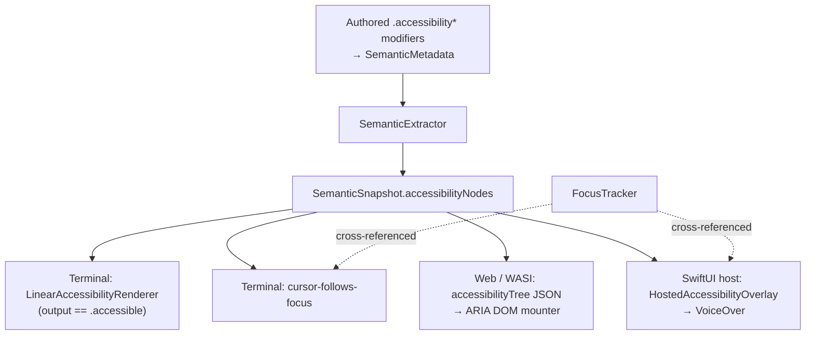
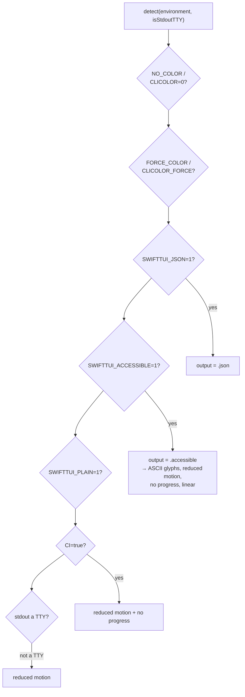

# Accessibility

SwiftTUI builds accessibility into the render pipeline rather than bolting it
on. Every frame produces one semantic snapshot; four different consumers
present it. This document describes the substrate and those consumers.

## The semantic substrate

Authored views attach semantic metadata with modifiers:

- `.accessibilityRole(_:)`
- `.accessibilityLabel(_:)`
- `.accessibilityHint(_:)`
- `.accessibilityHidden(_:)`
- `.accessibilityLiveRegion(_:)`
- `.accessibilityCursorAnchor(_:)`

These all write `SemanticMetadata`. During the semantics phase of the pipeline,
`SemanticExtractor` walks the placed tree and produces a `SemanticSnapshot`
whose `accessibilityNodes` is a flat array of `AccessibilityNode` values.

An `AccessibilityNode` carries: `identity`, `parentIdentity` (parent links are
stored, so the array reconstructs a tree), `rect`, `role`, `label`, `hint`,
`hidden`, `liveRegion`, and `cursorAnchor`. It deliberately does **not** bake in
focus state — consumers cross-reference live focus from `FocusTracker` when
they present, so one snapshot stays valid regardless of focus movement.

`AccessibilityRole` is an open-ended enum covering controls and structures
(button, link, text field, toggle, slider, tab, table, heading, and many more).
`AccessibilityPoliteness` has `.off`, `.polite`, and `.assertive`.
`AccessibilityAnnouncer.announce(_:politeness:)` lets app code push an
announcement to whatever accessibility target the active runtime exposes; calls
made outside a running runtime are silently ignored.

## One snapshot, four consumers

1. **Terminal linear renderer.** When the runtime output mode is `.accessible`,
   `LinearAccessibilityRenderer` emits a linear, screen-reader-friendly text
   rendering of the snapshot instead of the visual frame.
2. **Terminal cursor-follows-focus.** When `cursorFollowsFocus` is enabled, the
   terminal cursor tracks the focused node's `cursorAnchor`, so a terminal
   screen reader follows focus. This is opt-in and off by default.
3. **Web / WASI ARIA.** The `web-surface` wire frame carries the
   `accessibilityTree` as JSON (a v2 frame when the tree is present). In the
   browser, the canvas is `aria-hidden` and a sibling DOM tree is populated
   from that JSON so assistive technology reads the ARIA tree.
4. **SwiftUI host.** `HostedAccessibilityOverlay` mounts a zero-size native
   accessibility overlay over the raster surface; each `AccessibilityNode`
   becomes a native element with role-derived traits. Runtime focus is pushed
   to VoiceOver (the overlay's focused element follows the runtime).

The runtime-to-VoiceOver direction is one-way: VoiceOver-originated focus
traversal is not yet fed back into SwiftTUI's runtime focus. That gap, and the
absence of a WCAG conformance suite, are tracked in
[VISION-GAP.md](VISION-GAP.md).

## Reduced motion

`RuntimeConfiguration` resolves a motion policy that authored views can read as
`EnvironmentValues.accessibilityReduceMotion`. Built-in animated views honor
it: `Spinner` renders static text, `PhaseAnimator` renders only its first phase
without cycling, and `AnimatedImage` renders its first frame.

## Runtime configuration detection

The output, glyph, motion, and progress policy is resolved from the environment
and the TTY state by `RuntimeConfiguration.detect`. The precedence is fixed:

- `SWIFTTUI_JSON=1` selects JSON output and wins over `SWIFTTUI_ACCESSIBLE=1`.
- `SWIFTTUI_ACCESSIBLE=1` selects accessible output, which also forces ASCII
  glyphs, reduced motion, no progress animation, and linear rendering.
- `CI=true` implies both reduced motion and no progress animation.
- A non-TTY stdout implies reduced motion but not accessible output.
