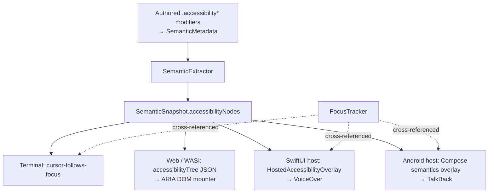

# Accessibility (internal notes)

The consumer-facing accessibility documentation (the semantic modifiers,
`AccessibilityRole`/`AccessibilityPoliteness`, `AccessibilityAnnouncer`,
reduced motion, and output-mode detection) is the published DocC article
[Accessibility](../Sources/SwiftTUIViews/SwiftTUIViews.docc/Accessibility.md)
(`SwiftTUIViews` catalog). This file holds the maintainer-facing pipeline
wiring: how one snapshot feeds every consumer path.

## The extraction pipeline

Authored `.accessibility*` modifiers write `SemanticMetadata`. During the
semantics phase of the pipeline, `SemanticExtractor` walks the placed tree and
produces a `SemanticSnapshot` whose `accessibilityNodes` is a flat array of
`AccessibilityNode` values. Parent links are stored, so the array
reconstructs a tree. The snapshot deliberately does **not** bake in focus
state. Consumers cross-reference live focus from `FocusTracker` during
presentation. Thus, one snapshot stays valid when focus moves.

## One snapshot, four consumers

```mermaid
flowchart TD
    meta["Authored .accessibility* modifiers<br/>→ SemanticMetadata"]
    extract["SemanticExtractor"]
    snap["SemanticSnapshot.accessibilityNodes"]
    meta --> extract --> snap

    snap --> cursor["Terminal: cursor-follows-focus"]
    snap --> web["Web / WASI: accessibilityTree JSON<br/>→ ARIA DOM mounter"]
    snap --> swiftui["SwiftUI host: HostedAccessibilityOverlay<br/>→ VoiceOver"]
    snap --> android["Android host: Compose semantics overlay<br/>→ TalkBack"]

    focus["FocusTracker"] -.cross-referenced.-> cursor
    focus -.cross-referenced.-> swiftui
    focus -.cross-referenced.-> android
```

1. **Terminal cursor-follows-focus.** When `cursorFollowsFocus` is enabled
   (directly or through the `SWIFTTUI_ACCESSIBLE` alias), the terminal cursor
   tracks the focused node's `cursorAnchor`, so a terminal screen reader
   follows focus. This is opt-in and off by default.
2. **Web / WASI ARIA.** The `web-surface` wire frame carries the
   `accessibilityTree` as JSON (a v2 frame when the tree is present). In the
   browser, the canvas is `aria-hidden` and a sibling DOM tree is populated
   from that JSON so assistive technology reads the ARIA tree.
3. **SwiftUI host.** `HostedAccessibilityOverlay` mounts a zero-size native
   accessibility overlay over the raster surface. Each `AccessibilityNode`
   becomes a native element with role-derived traits. Runtime focus is pushed
   to VoiceOver (the overlay's focused element follows the runtime).
4. **Android host.** `SwiftTUIAndroidHost` serializes accessibility nodes and
   announcements into the Android frame snapshot. `AndroidGallery` mounts a
   transparent Compose semantics overlay over the canvas so TalkBack can read
   the semantic tree rather than a single opaque image.

A fifth consumer lives outside the runtime: the `SwiftTUITestSupport` seam
`renderLinearAccessibilityOutput(_:)` renders a snapshot to a linear
reading-order string (via the internal `LinearAccessibilityRenderer`) so
external packages can assert on assistive output for their views.

## Known gaps

The runtime-to-native-assistive-technology direction is one-way: VoiceOver- or
TalkBack-originated focus traversal is not yet fed back into SwiftTUI's runtime
focus. That gap, and the absence of a WCAG conformance suite, are tracked in
the [divergence and gap register](../Sources/SwiftTUIViews/SwiftTUIViews.docc/Divergences-And-Gaps.md).

The manual screen-reader listening review protocol lives in
`Tests/SwiftTUITests/Accessibility/README.md`.
