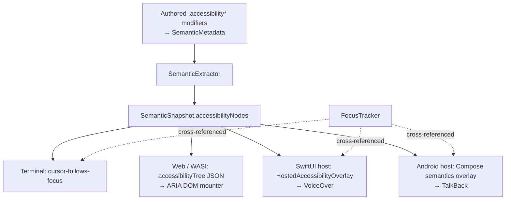

# Accessibility (internal notes)

The consumer-facing accessibility documentation (the semantic modifiers,
`AccessibilityRole`/`AccessibilityPoliteness`, `AccessibilityAnnouncer`,
reduced motion, and output-mode detection) is the published DocC article
[Accessibility](../Sources/SwiftTUIViews/SwiftTUIViews.docc/Accessibility.md)
(`SwiftTUIViews` catalog). This file holds the maintainer-facing pipeline
wiring: how one snapshot feeds every consumer path.

## The extraction pipeline

Authored `.accessibility*` modifiers write `SemanticMetadata`. During the
semantics phase of the pipeline, `SemanticExtractor` walks the placed tree and
produces a `SemanticSnapshot` whose `accessibilityNodes` is a flat array of
`AccessibilityNode` values. Parent links are stored, so the array
reconstructs a tree. The snapshot deliberately does **not** bake in focus
state. Consumers cross-reference live focus from `FocusTracker` during
presentation. Thus, one snapshot stays valid when focus moves.

## One snapshot, four consumers


```mermaid
flowchart TD
    meta["Authored .accessibility* modifiers<br/>→ SemanticMetadata"]
    extract["SemanticExtractor"]
    snap["SemanticSnapshot.accessibilityNodes"]
    meta --> extract --> snap

    snap --> cursor["Terminal: cursor-follows-focus"]
    snap --> web["Web / WASI: accessibilityTree JSON<br/>→ ARIA DOM mounter"]
    snap --> swiftui["SwiftUI host: HostedAccessibilityOverlay<br/>→ VoiceOver"]
    snap --> android["Android host: Compose semantics overlay<br/>→ TalkBack"]

    focus["FocusTracker"] -.cross-referenced.-> cursor
    focus -.cross-referenced.-> swiftui
    focus -.cross-referenced.-> android
```

1. **Terminal cursor-follows-focus.** When `cursorFollowsFocus` is enabled
   (directly or through the `SWIFTTUI_ACCESSIBLE` alias), the terminal cursor
   tracks the focused node's `cursorAnchor`, so a terminal screen reader
   follows focus. This is opt-in and off by default.
2. **Web / WASI ARIA.** The `web-surface` wire frame carries the
   `accessibilityTree` as JSON (a v2 frame when the tree is present). In the
   browser, the canvas is `aria-hidden` and a sibling DOM tree is populated
   from that JSON so assistive technology reads the ARIA tree.
3. **SwiftUI host.** `HostedAccessibilityOverlay` mounts a zero-size native
   accessibility overlay over the raster surface. Each `AccessibilityNode`
   becomes a native element with role-derived traits. Runtime focus is pushed
   to VoiceOver (the overlay's focused element follows the runtime).
4. **Android host.** `SwiftTUIAndroidHost` serializes accessibility nodes and
   announcements into the Android frame snapshot. `AndroidGallery` mounts a
   transparent Compose semantics overlay over the canvas so TalkBack can read
   the semantic tree rather than a single opaque image.

A fifth consumer lives outside the runtime: the `SwiftTUITestSupport` seam
`renderLinearAccessibilityOutput(_:)` renders a snapshot to a linear
reading-order string (via the internal `LinearAccessibilityRenderer`) so
external packages can assert on assistive output for their views.

## Assistive action contract

`AccessibilityNode.actionTarget` identifies one live control in one scene. It
is opaque: adapters must echo the published token, never derive it from the
public authored identity, and discard tokens when the scene ends. A recreated
control gets a new token even if its authored identity is reused. Requests
resolve against the latest committed semantic tree and active focus regions.
They do not synthesize keyboard events or invoke ancestor key handlers.

`control.actions` advertises focus, activate, increment, decrement, and/or
setValue. `control.value` is boolean, number, or text. Numeric controls publish
optional minimum, maximum and step. SecureField omits its value entirely.
The runtime rejects stale, disabled, hidden/out-of-scope and unsupported targets,
wrong value types, nonfinite numbers and numbers outside published bounds.
The owning control compares against its live binding so value echoes are inert,
including multiple requests before the next render. Focus echoes are also inert.

Supported primitive routes:

| Control | Actions besides focus | Published value |
| --- | --- | --- |
| Button and activating controls | activate | none |
| Toggle, DisclosureGroup | activate, setValue | boolean |
| Slider, Stepper | increment, decrement, setValue | number |
| TextField, TextEditor | setValue | text |
| SecureField | setValue | omitted |

### Wire compatibility

Full and delta records add optional node fields `actionTarget`, `actions`,
`isEnabled`, `value` (`{type: "boolean"|"number"|"text", value: ...}`),
`valueMin`, `valueMax`, and `valueStep`. Existing presentation-only nodes omit
these fields. A host must require an action token and advertised action before
sending a request; this also detects older runtimes without action support.
Unknown optional fields remain ignorable by older hosts.

The shared WASI/WebSocket input parser accepts newline-terminated records
introduced by RS (`0x1e`):

```text
accessibility:<percent-encoded-target>:focus
accessibility:<percent-encoded-target>:activate
accessibility:<percent-encoded-target>:increment
accessibility:<percent-encoded-target>:decrement
accessibility:<percent-encoded-target>:setValue:<boolean|number|text>:<percent-encoded-value>
```

Encode UTF-8 bytes using URI-component escaping, including colons, newlines,
percent signs, and RS. Invalid or oversized records are discarded under the
existing input budget. A host can insert a decimal request ID immediately after `accessibility:`.
The next presented frame includes `accessibilityActionResponse` with that ID
(as a decimal string), target token, and result. The response is a persistent
watermark for the last processed request, including rejections and no-ops;
coalesced or polled frames therefore acknowledge every earlier request on the
same ordered scene channel. It never repeats submitted values. Hosts use it
to keep an unacknowledged edit from being overwritten by an older frame and to
restore authoritative state after rejection. IDs belong to one scene session.
Values and focus in subsequent frames remain runtime-authoritative; adapters
must suppress callbacks while reflecting them.
The Swift entry point is `HostedSceneSession.send(.accessibility(request))`.
The request has no authority outside its owning scene and must use that scene's
input channel. Host-specific adapters and actual assistive acceptance are
separate from this shared dispatch implementation.

## Known gaps

Browser, SwiftUI and Android overlays need assistive callbacks connected to the
shared contract. A WCAG conformance suite and screen-reader listening evidence
are not established by semantic snapshots or runtime tests. Current gaps are
tracked in the [divergence and gap register](../Sources/SwiftTUIViews/SwiftTUIViews.docc/Divergences-And-Gaps.md).

The manual screen-reader listening review protocol lives in
`Tests/SwiftTUITests/Accessibility/README.md`.
