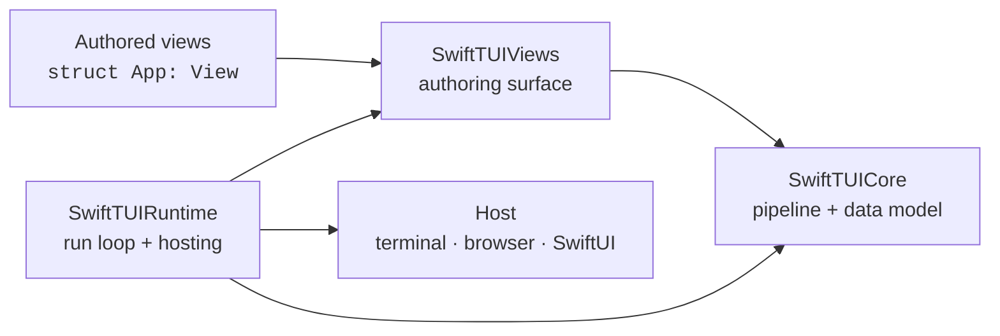
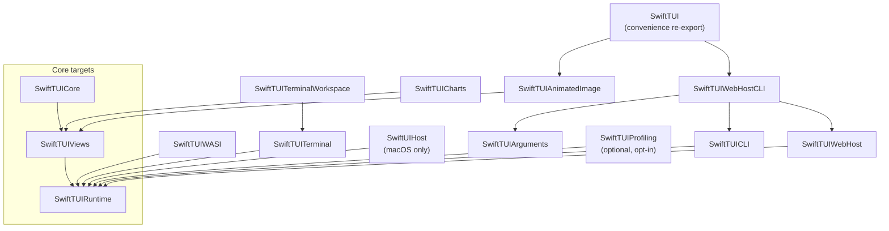

# Architecture

This document describes how the SwiftTUI codebase is organized: its modules,
its products, the dependency graph, the source layout, and the layout model.
For the rendering internals see [RENDER-PIPELINE.md](RENDER-PIPELINE.md); for
the execution environments see [HOSTS-AND-PLATFORMS.md](HOSTS-AND-PLATFORMS.md).

## The big picture



An author writes `View` values. `SwiftTUIViews` defines that authoring surface.
`SwiftTUICore` is the engine: geometry, the frame pipeline, and the data model
each pipeline phase produces. `SwiftTUIRuntime` owns the run loop, drives the
pipeline, and connects it to a host. A host turns a finished frame into pixels
or terminal bytes.

## Modules and the dependency graph

`SwiftTUI/swift-tui` is one SwiftPM package. Browser TypeScript source,
examples, and the public website may live in sibling organization repositories,
but the public Swift products below remain in this package unless a later
extraction explicitly promotes their package-private seams into stable public
API. Internally it has three core targets and a set of product targets layered
on top.



### Core targets

- **`SwiftTUICore`** — the engine. Geometry, the layout engine, the seven
  pipeline phases and their typed products, the semantic and draw extractors,
  the rasterizer, the commit planner, the scheduler, diagnostics, and the
  shared data model. It is an internal target, **not** a published product; it
  reaches consumers re-exported through `SwiftTUIRuntime`.
- **`SwiftTUIViews`** — the authoring surface. The `View` protocol, view
  builders, containers, controls, layout, state, focus, gestures, modifiers,
  and shapes. `View` is body-only and `@MainActor`-isolated; lowering to
  primitives is package-internal.
- **`SwiftTUIRuntime`** — the run loop, the renderer, scenes (`App`, `Scene`,
  `WindowGroup`), terminal hosting, and the host-frame contracts.

### Published library products

- **`SwiftTUI`** — the batteries-included convenience product. It re-exports
  the combined terminal/WebHost CLI surface and `SwiftTUIAnimatedImage`, so an
  ordinary app writes only `import SwiftTUI` and gets standard flags, default
  terminal `App.main()`, `--web` localhost launch, and animated GIF/image
  support.
- **`SwiftTUIRuntime`**, **`SwiftTUIViews`** — usable directly by hosts and
  custom launchers that do not want the convenience product.
- **`SwiftTUICharts`** — `LineChart`, `CalendarHeatmap`, `Sparkline`, and
  related dashboard views. Charting is not included in the default `SwiftTUI`
  import.
- **`SwiftTUIAnimatedImage`** — finite, pre-composed animated-image playback and
  GIF import/export. It is available as a standalone product for narrow
  compositions and is included by the `SwiftTUI` convenience product.
- **`SwiftTUIProfiling`** — optional, opt-in profiling and diagnostics. It adds a
  `.profiling()` scene modifier (env-gated via `SWIFTTUI_PROFILE`) carrying three
  independently selectable signals — per-frame timing, memory occupancy, and
  CPU/RSS — routed to TSV, JSONL, or summary sinks. Nothing in the default graph
  depends on it; activation is zero-cost until requested. It builds on the
  runtime's neutral emit contract (`FrameDiagnosticSink` / `RuntimeFrameSample`)
  and the `SwiftTUICore` occupancy registry, so the runtime never depends on the
  product. Not included in the `SwiftTUI` convenience import.

### Platform, host, and embedding products

All of these live in the **root package** (`Package.swift`); the `Platforms/`
directory holds their sources but contains no nested Swift packages.

- **Runners** — `SwiftTUICLI` (`TerminalRunner`), `SwiftTUIWASI` (`WASIRunner`),
  `SwiftTUIWebHost` (`WebHostRunner`), `SwiftTUIWebHostCLI` (`WebHostCLIRunner`),
  and `SwiftTUIArguments` (argument parsing and `RuntimeConfiguration` flags).
- **Hosts** — `SwiftUIHost` retains `HostedSceneSession` values inside a SwiftUI
  app. It depends on `SwiftTUIRuntime` directly and is **macOS-only**
  (`#if os(Linux)` excludes it).
- **Terminal-program embedding** — `SwiftTUITerminal` (`TerminalView`,
  `TerminalSession`, `TerminalProcessSession`), `SwiftTUITerminalWorkspace`
  (tabbed/split-pane workspace surfaces), and `SwiftTUIPTYPrimitives` (pty
  creation, fd lifecycle, resize). These are macOS- and Linux-only.

`SwiftTUIWebHost` owns the embedded HTTP/WebSocket server (FlyingFox) and the
bundled browser resources. `SwiftTUIWebHostCLI` composes that host with the
terminal runner, and the `SwiftTUI` convenience product includes it by default.
Use `SwiftTUICLI` directly for a terminal-only graph.

## Source layout

```
Sources/
  SwiftTUICore/        Geometry, Measure, Place, Resolve, Semantics, Draw,
                       Raster, Commit, Pipeline, Animation, Styling, Pointer,
                       Runtime, Content, Support  + SwiftTUICore.docc
  SwiftTUIViews/       Foundation, ViewBuilder, Primitives, Controls, Stacks,
                       Layout, State, Focus, Gestures, Collections, Modifiers,
                       NavigationViews, TabViews, Presentation, ScrollView, Shapes,
                       Animation, Environment, GeometryReading  + .docc
  SwiftTUIRuntime/     RunLoop, Rendering, Scenes, Terminal, Lifecycle, Input,
                       Accessibility, Configuration, Diagnostics  + .docc
  SwiftTUICharts/      Chart views  + SwiftTUICharts.docc
  SwiftTUIAnimatedImage/  Animated image playback  + .docc
  SwiftTUI/            Convenience re-export target  + SwiftTUI.docc
  SwiftTUIProfiling/   Activation, Sinks, CPU, Memory, Progress  + .docc
                       (optional opt-in profiling product)
Platforms/             Arguments, CLI, WASI, WebHost,
                       Embedding, SwiftUI  (sources for the product targets)
Vendor/                swift-figlet, swift-gif, swift-jpeg, swift-png,
                       UnixSignals  (third-party code, own licenses)
Tools/TermUIPerf/      Performance scenario harness
```

Runnable example apps live in the sibling `SwiftTUI/swift-tui-examples`
repository; they are demos and regression coverage, not published products.

## The frame pipeline, in one paragraph

A frame is built by running an authored view tree through **seven typed
phases** — `resolve → measure → place → semantics → draw → raster → commit` —
each producing a distinct value type (`ResolvedNode`, `MeasuredNode`,
`PlacedNode`, `SemanticSnapshot`, `DrawNode`, `RasterSurface`, `CommitPlan`).
The runtime drives those phases through a small **stage pipeline**
(`head → animationInjection → latePreferenceReconciliation → fusedFrameTail →
commit`) that decides what runs on the main actor versus a frame-tail worker.
The full mechanics are in [RENDER-PIPELINE.md](RENDER-PIPELINE.md).

## The layout model

Layout is SwiftUI-shaped: a recursive size negotiation, not a constraint
solver.

1. A parent proposes a size to each child.
2. Each child reports the size it wants for that proposal.
3. The parent places each child within its own bounds.

Modifier order matters, because each modifier is a node in the tree that
re-proposes or re-places. `Layout`, `AnyLayout`, and `ViewThatFits` expose this
to authored code; `LayoutValueKey` carries per-child layout data.

Some content cannot be sized until its container's geometry is known —
`GeometryReader` and anchor-based preferences. SwiftTUI handles this with
**layout-dependent content realization**: the affected subtree is realized once
the enclosing geometry resolves, rather than guessed and corrected.

Custom layouts run on the main actor unless they conform to `SendableLayout`
(value and cache `Sendable`, with stable measurement/placement reuse
signatures), which lets the renderer evaluate them on the frame-tail worker.

## The four execution modes

The same resolved frame can be presented four ways: a **terminal**, a
**WASI/browser** canvas, a **host-managed** raster surface inside a SwiftUI app,
and a **localhost-browser WebHost**. Each is a different *host*; the pipeline
above them is identical. See [HOSTS-AND-PLATFORMS.md](HOSTS-AND-PLATFORMS.md).

## Concurrency model

The package builds in Swift 6 language mode with `.defaultIsolation(.none)` —
isolation is stated explicitly, never inferred. `View`, `Scene`, and `App` are
`@MainActor` authoring protocols, and APIs that evaluate authored `body` trees
(`Resolver.resolve`, `DefaultRenderer.render`) are `@MainActor`. The heavy
middle of the pipeline runs off the main actor on a frame-tail worker; the
boundaries are spelled out in [RENDER-PIPELINE.md](RENDER-PIPELINE.md). The repo
forbids `@unchecked Sendable` and `nonisolated(unsafe)`; shared mutable state
uses honest isolation or `Synchronization` primitives.

## Glossary

- **Phase product** — the typed value a pipeline phase emits (`ResolvedNode`,
  `MeasuredNode`, `PlacedNode`, `SemanticSnapshot`, `DrawNode`, `RasterSurface`,
  `CommitPlan`). All seven are gathered on `FrameArtifacts`.
- **Resolve** — turning an authored `View` tree into a `ResolvedNode` graph
  with identity and state attached.
- **Frame tail** — the off-main portion of a frame: measure through raster.
- **Frame head** — the on-main portion that resolves the tree and stages
  side effects before the tail runs.
- **Commit** — applying a finished frame's `CommitPlan` to a host surface.
- **Cell space** — the integer terminal grid (`CellPoint`, `CellSize`,
  `CellRect`).
- **Continuous cell space** — fractional coordinates over that grid (`Point`,
  `Size`, `Rect`, `Vector`), used for gestures, hover, drawing, and animation.
- **Pixel space** — device pixels (`PixelPoint`, `PixelSize`), used only for
  host/graphics interop.
- **Semantic snapshot** — the per-frame `SemanticSnapshot`, including the flat
  `accessibilityNodes` array, consumed by accessibility and focus.
- **Host** — the component that presents a committed frame: a terminal, a
  browser canvas, or a SwiftUI raster surface.
- **Action scope** — a node in the focus chain that can own key commands,
  palette commands, and toolbar items (`ActionScope`).
