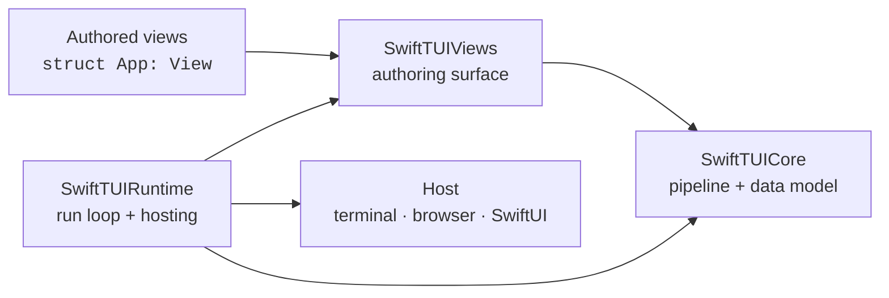
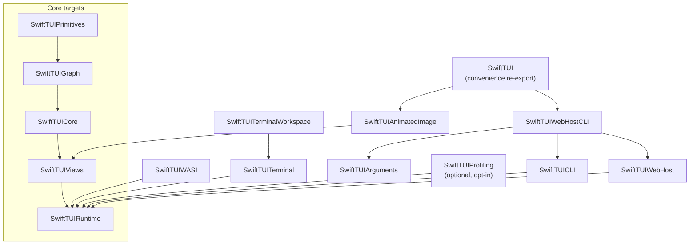

# Architecture

This internal document describes how the SwiftTUI codebase is organized: its
modules, products, dependency graph, source layout, and layout model. For the
developer-facing rendering internals, see
[`Runtime-Render-Pipeline.md`](../Sources/SwiftTUIRuntime/SwiftTUIRuntime.docc/Runtime-Render-Pipeline.md);
for internal execution-environment notes, see
[HOSTS-AND-PLATFORMS.md](HOSTS-AND-PLATFORMS.md).

## The big picture



An author writes `View` values. `SwiftTUIViews` defines that authoring surface.
`SwiftTUICore` is the engine: geometry, the frame pipeline, and the data model
each pipeline phase produces. `SwiftTUIRuntime` owns the run loop, drives the
pipeline, and connects it to a host. A host turns a finished frame into pixels
or terminal bytes.

## Modules and the dependency graph

`SwiftTUI/swift-tui` is one SwiftPM package. Browser TypeScript source,
examples, and the public website may live in sibling organization repositories,
but the public Swift products below remain in this package unless a later
extraction explicitly promotes their package-private seams into stable public
API. Internally the engine is a layered stack of internal targets
(`SwiftTUIPrimitives` → `SwiftTUIGraph` → `SwiftTUICore` → `SwiftTUIViews` →
`SwiftTUIRuntime`), with a set of product targets layered on top.



### Core targets

The engine is factored into three internal targets with a compiler-enforced
boundary — an AttributeGraph-shaped separation of the reconciliation engine from
the render machinery. None is a published product; all reach consumers
re-exported (`@_exported`) through `SwiftTUICore` and then `SwiftTUIRuntime`.

- **`SwiftTUIPrimitives`** — the leaf vocabulary. Inert `Equatable`/`Sendable`
  value types with no engine and no render-pipeline algorithms: geometry
  (cells/points/rects, `Identity`/`StructuralPath`/`EntityIdentity`), the style
  and color-science values, the draw/layout metadata value types (`DrawPayload`
  and its payload cluster, `LayoutBehavior`, `LayoutMetadata`), the pointer and
  semantic value types, and the `Animatable` math stack. Foundation-free;
  depends on nothing but the stdlib (plus `SwiftTUIVendorFigletEmbeddedFonts` for the figlet payload
  value). It builds standalone.
- **`SwiftTUIGraph`** — the reconciliation engine (the AttributeGraph analog).
  The retained `ViewGraph`/`ViewNode`/`ResolvedNode` graph, state slots,
  dependency tracking, invalidation and dirty-evaluation planning, reuse gates,
  checkpoints, entity routing, lifecycle planning, the identity-keyed runtime
  registries, the frame scheduler, and the animation *intent* types. It performs
  no layout/draw/raster/commit work — it stores render values opaquely and hands
  erased evaluator thunks up to the Views driver. Depends on `SwiftTUIPrimitives`
  **only**; `swift build --target SwiftTUIGraph` compiling in isolation is the
  compiler proof that graph code never names a render type. Foundation-free.
- **`SwiftTUICore`** — the render engine. Consumes the graph's immutable
  `ResolvedNode` snapshots and runs the render phases: measure, place, the
  semantic and draw extractors, the rasterizer, the commit planner, the text/
  image content engine, style *resolution*, focus tracking, and frame-drop/
  elision policy. The one sanctioned back-edge from render to graph is the
  layout-dependent-content realization callback (the GeometryReader analog).
  Depends on `SwiftTUIGraph` + `SwiftTUIPrimitives` and `@_exported`-imports both
  so downstream `import SwiftTUICore` is unchanged. Foundation-free.
- **`SwiftTUIViews`** — the authoring surface. The `View` protocol, view
  builders, containers, controls, layout, state, focus, gestures, modifiers,
  and shapes. `View` is body-only and `@MainActor`-isolated; lowering to
  primitives is package-internal.
- **`SwiftTUIRuntime`** — the run loop, the renderer, scenes (`App`, `Scene`,
  `WindowGroup`), terminal hosting, and the host-frame contracts.

### Published library products

- **`SwiftTUI`** — the batteries-included convenience product. It re-exports
  the combined terminal/WebHost CLI surface and `SwiftTUIAnimatedImage`, so an
  ordinary app writes only `import SwiftTUI` and gets standard flags, default
  terminal `App.main()`, `--web` localhost launch, and animated GIF/image
  support.
- **`SwiftTUIRuntime`**, **`SwiftTUIViews`** — usable directly by hosts and
  custom launchers that do not want the convenience product.
- **`SwiftTUICharts`** (external) — `LineChart`, `CalendarHeatmap`,
  `Sparkline`, and related dashboard views now ship from the peer repository
  [`SwiftTUI/swift-tui-charts`](https://github.com/SwiftTUI/swift-tui-charts),
  composed on the public `SwiftTUIViews` surface.
- **`SwiftTUIAnimatedImage`** — finite, pre-composed animated-image playback and
  GIF import/export. It is available as a standalone product for narrow
  compositions and is included by the `SwiftTUI` convenience product.
- **`SwiftTUIProfiling`** — optional, opt-in profiling and diagnostics. It adds a
  `.profiling()` scene modifier (env-gated via `SWIFTTUI_PROFILE`) carrying three
  independently selectable signals — per-frame timing, memory occupancy, and
  CPU/RSS — routed to TSV, JSONL, or summary sinks. Nothing in the default graph
  depends on it; activation is zero-cost until requested. It builds on the
  runtime's neutral emit contract (`FrameDiagnosticSink` / `RuntimeFrameSample`)
  and the `SwiftTUICore` occupancy registry, so the runtime never depends on the
  product. Not included in the `SwiftTUI` convenience import.

### Platform, host, and embedding products

All of these live in the **root package** (`Package.swift`); the `Platforms/`
directory holds their sources but contains no nested Swift packages.

- **Runners** — `SwiftTUICLI` (`TerminalRunner`), `SwiftTUIWASI` (`WASIRunner`),
  `SwiftTUIWebHost` (`WebHostRunner`), `SwiftTUIWebHostCLI` (`WebHostCLIRunner`),
  and `SwiftTUIArguments` (argument parsing and `RuntimeConfiguration` flags).
- **Hosts** — The native SwiftUI host (for embedding a SwiftTUI app in a SwiftUI
  view on macOS/iOS) now lives in the separate `swift-tui-swiftui` package:
  https://github.com/SwiftTUI/swift-tui-swiftui
- **Terminal-program embedding** — `SwiftTUITerminal` (`TerminalView`,
  `TerminalSession`, `TerminalProcessSession`), `SwiftTUITerminalWorkspace`
  (tabbed/split-pane workspace surfaces), and `SwiftTUIPTYPrimitives` (pty
  creation, fd lifecycle, resize). These are macOS- and Linux-only.

`SwiftTUIWebHost` owns the embedded HTTP/WebSocket server (FlyingFox) and the
bundled browser resources. `SwiftTUIWebHostCLI` composes that host with the
terminal runner, and the `SwiftTUI` convenience product includes it by default.
Use `SwiftTUICLI` directly for a terminal-only graph.

## Source layout

```
Sources/
  SwiftTUIPrimitives/  Geometry, Support, Pointer, Styling (values), Content
                       (value models), Draw (payload value cluster), Measure
                       (LayoutBehavior/LayoutMetadata), Animation (math)
  SwiftTUIGraph/       Resolve, Runtime, Pipeline/Scheduler, Animation (intent),
                       Semantics (regions/roles), Geometry/AnchorTypes
  SwiftTUICore/        Measure, Place, Semantics (extractor/FocusTracker), Draw
                       (extractor), Raster, Commit, Content (text engine),
                       Styling (resolution), Pipeline (drop/elision/snapshots),
                       Pointer  + SwiftTUICore.docc
  SwiftTUIViews/       Foundation, ViewBuilder, Primitives, Controls, Stacks,
                       Layout, State, Focus, Gestures, Collections, Modifiers,
                       NavigationViews, TabViews, Presentation, ScrollView, Shapes,
                       Animation, Environment, GeometryReading  + .docc
  SwiftTUIRuntime/     RunLoop, Rendering, Scenes, Terminal, Lifecycle, Input,
                       Accessibility, Configuration, Diagnostics  + .docc
  SwiftTUIAnimatedImage/  Animated image playback  + .docc
  SwiftTUI/            Convenience re-export target  + SwiftTUI.docc
  SwiftTUIProfiling/   Activation, Sinks, CPU, Memory, Progress  + .docc
                       (optional opt-in profiling product)
Platforms/             Arguments, CLI, WASI, WebHost,
                       Embedding, SwiftUI  (sources for the product targets)
Vendor/                swift-figlet, swift-gif, swift-jpeg, swift-png,
                       UnixSignals  (third-party code, own licenses)
Tools/TermUIPerf/      Performance scenario harness
```

Runnable example apps live in the sibling `SwiftTUI/swift-tui-examples`
repository; they are demos and regression coverage, not published products.

### Vendored target naming

Sources under `Vendor/` keep their upstream directory names, but the SwiftPM
**targets** they declare are all prefixed `SwiftTUIVendor…`:

| Upstream module | swift-tui target | Sources |
| --- | --- | --- |
| `UnixSignals` | `SwiftTUIVendorUnixSignals` | `Vendor/UnixSignals/` |
| `SwiftFiglet` | `SwiftTUIVendorFiglet` | `Vendor/swift-figlet/` |
| `EmbeddedFonts` | `SwiftTUIVendorFigletEmbeddedFonts` | `Vendor/swift-figlet/` |
| `GIF` | `SwiftTUIVendorGIF` | `Vendor/swift-gif/` |
| `JPEG` | `SwiftTUIVendorJPEG` | `Vendor/swift-jpeg/` |
| `PNG` | `SwiftTUIVendorPNG` | `Vendor/swift-png/` |

SwiftPM requires target names to be unique across the **entire** package graph,
and any target reachable from one of our products enters every consumer's graph.
Under their upstream names these modules break consumers outright: a package that
depends on both swift-tui and swift-service-lifecycle (which ships its own
`UnixSignals`) fails resolution with

```
error: multiple packages ('swift-service-lifecycle', 'swift-tui') declare
targets with a conflicting name: 'UnixSignals'
```

`GIF` / `JPEG` / `PNG` / `SwiftFiglet` are no safer — they are exactly the names
an image or text package would reach for. The prefix removes the hazard and makes
the vendoring legible at the use site: `import SwiftTUIVendorPNG` is obviously our
absorbed copy, not upstream swift-png.

The same reasoning covers first-party `SwiftTUIWASISurfaceBridge` (sources at
`Platforms/WASI/Sources/WASISurfaceBridge/`), which is reachable from the
`SwiftTUIWASI` and `SwiftTUIWebHost` products.

Only the `import` line carries the vendored name. `GIF`, `JPEG`, and `PNG` each
declare a `public enum` matching their old module name, so use sites such as
`PNG.Image` continue to resolve against the enum and are unaffected.

## The frame pipeline, in one paragraph

A frame is built by running an authored view tree through **seven typed
phases** — `resolve → measure → place → semantics → draw → raster → commit` —
each producing a distinct package-owned product (`ResolvedNode`, `MeasuredNode`,
`PlacedNode`, `SemanticSnapshot`, `DrawNode`, `RasterSurface`, `CommitPlan`).
The public one-shot renderer returns a `RenderSnapshot`, which exposes the
committed raster, semantic snapshot, presentation damage, and diagnostics while
keeping intermediate phase IR package-only.
The runtime drives those phases through a small **stage pipeline**
(`head → animationInjection → latePreferenceReconciliation → fusedFrameTail →
commit`) that decides what runs on the main actor versus a frame-tail worker.
The full developer-facing mechanics are in
[`Runtime-Render-Pipeline.md`](../Sources/SwiftTUIRuntime/SwiftTUIRuntime.docc/Runtime-Render-Pipeline.md).

`resolve` reuses unchanged work two ways. **Retained reuse** skips a subtree
disjoint from the frame's invalidation. **Memoized-body reuse** (on by default)
additionally skips a subtree reached *under* an invalidated ancestor when its
view value is `Equatable`-equal to last frame's, it read no
`@State`/`@Observable`/focus state, and it passes the retained-reuse guards —
the `EquatableView` / `View.equatable()` opt-in. It is `Equatable`-only, so it is
inert on views that do not opt in; set `SWIFTTUI_MEMO_REUSE=0` to disable it.

## The layout model

Layout is SwiftUI-shaped: a recursive size negotiation, not a constraint
solver.

1. A parent proposes a size to each child.
2. Each child reports the size it wants for that proposal.
3. The parent places each child within its own bounds.

Modifier order matters, because each modifier is a node in the tree that
re-proposes or re-places. `Layout`, `AnyLayout`, and `ViewThatFits` expose this
to authored code; `LayoutValueKey` carries per-child layout data.

Some content cannot be sized until its container's geometry is known —
`GeometryReader` and anchor-based preferences. SwiftTUI handles this with
**layout-dependent content realization**: the affected subtree is realized once
the enclosing geometry resolves, rather than guessed and corrected.

Custom layouts are `Sendable` values with `Sendable` caches — `Layout` itself
requires both — so the renderer can evaluate any custom layout on the
frame-tail worker. Layouts may additionally publish stable
measurement/placement reuse signatures to opt into cross-frame reuse.

## The four execution modes

The same resolved frame can be presented four ways: a **terminal**, a
**WASI/browser** canvas, a **host-managed** raster surface inside a SwiftUI app,
and a **localhost-browser WebHost**. Each is a different *host*; the pipeline
above them is identical. See [HOSTS-AND-PLATFORMS.md](HOSTS-AND-PLATFORMS.md).

## Concurrency model

The package builds in Swift 6 language mode with `.defaultIsolation(.none)` —
isolation is stated explicitly, never inferred. `View`, `Scene`, and `App` are
`@MainActor` authoring protocols, and the public APIs that evaluate authored
`body` trees (`DefaultRenderer.render` and `DefaultRenderer.renderAsync`) are
`@MainActor`. The package-only `Resolver.resolve` entry point is also
`@MainActor`. The heavy middle of the pipeline runs off the main actor on a
frame-tail worker; the boundaries are spelled out in
[`Runtime-Render-Pipeline.md`](../Sources/SwiftTUIRuntime/SwiftTUIRuntime.docc/Runtime-Render-Pipeline.md). The repo
forbids `@unchecked Sendable` and `nonisolated(unsafe)`; shared mutable state
uses honest isolation or `Synchronization` primitives.

## Glossary

- **Phase product** — the package-only typed value a pipeline phase emits
  (`ResolvedNode`, `MeasuredNode`, `PlacedNode`, `SemanticSnapshot`, `DrawNode`,
  `RasterSurface`, `CommitPlan`). All seven are gathered on package-only
  `FrameArtifacts`; public snapshot and host code consumes `RenderSnapshot`,
  `RasterSurface`, `SemanticSnapshot`, or `SemanticHostFrame`.
- **Resolve** — turning an authored `View` tree into a `ResolvedNode` graph
  with the resolved identity projection, structural position, entity identity,
  and state owner attached.
- **Frame tail** — the off-main portion of a frame: measure through raster.
- **Frame head** — the on-main portion that resolves the tree and stages
  side effects before the tail runs.
- **Commit** — applying a finished frame's `CommitPlan` to a host surface.
- **Cell space** — the integer terminal grid (`CellPoint`, `CellSize`,
  `CellRect`).
- **Continuous cell space** — fractional coordinates over that grid (`Point`,
  `Size`, `Rect`, `Vector`), used for gestures, hover, drawing, and animation.
- **Pixel space** — device pixels (`PixelPoint`, `PixelSize`), used only for
  host/graphics interop.
- **Semantic snapshot** — the per-frame `SemanticSnapshot`, including the flat
  `accessibilityNodes` array, consumed by accessibility and focus.
- **Host** — the component that presents a committed frame: a terminal, a
  browser canvas, or a SwiftUI raster surface.
- **Action scope** — a node in the focus chain that can own key commands,
  palette commands, and toolbar items (`ActionScope`).
