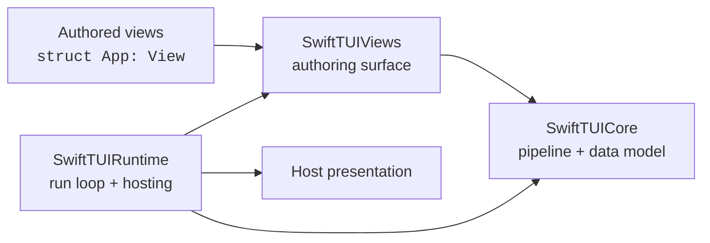
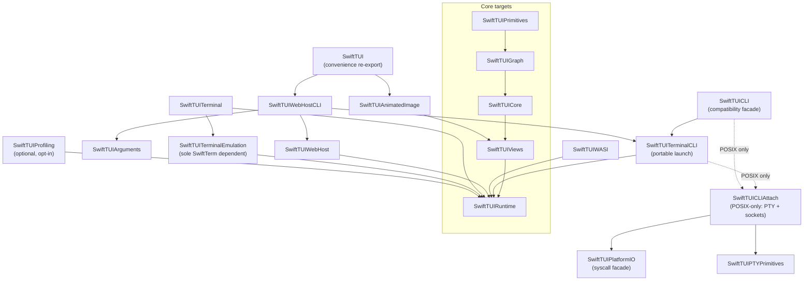

# Architecture

This internal document describes the SwiftTUI modules, products, dependency
graph, source layout, and layout model. For the rendering internals, see
[`Runtime-Render-Pipeline.md`](../Sources/SwiftTUIRuntime/SwiftTUIRuntime.docc/Runtime-Render-Pipeline.md). For internal execution-environment notes, see
[HOSTS-AND-PLATFORMS.md](HOSTS-AND-PLATFORMS.md).

## The big picture


```mermaid
flowchart LR
    author["Authored views<br/><code>struct App: View</code>"]
    views["SwiftTUIViews<br/>authoring surface"]
    core["SwiftTUICore<br/>pipeline + data model"]
    runtime["SwiftTUIRuntime<br/>run loop + hosting"]
    host["Host presentation"]

    author --> views
    views --> core
    runtime --> core
    runtime --> views
    runtime --> host
```

An author writes `View` values. `SwiftTUIViews` defines that authoring surface.
`SwiftTUICore` is the engine: geometry, the frame pipeline, and the data model
each pipeline phase produces. `SwiftTUIRuntime` owns the run loop, drives the
pipeline, and connects it to a host. A host turns a finished frame into pixels
or terminal bytes.

## Modules and the dependency graph

`SwiftTUI/swift-tui` is one SwiftPM package. Browser TypeScript source,
examples, and the public website can live in sibling organization repositories.
The public Swift products below remain in this package unless a later
extraction promotes their package-private seams to stable public API. The engine
is a layered stack of internal targets
(`SwiftTUIPrimitives` → `SwiftTUIGraph` → `SwiftTUICore` → `SwiftTUIViews` →
`SwiftTUIRuntime`), with a set of product targets layered on top.


```mermaid
flowchart TD
    subgraph engine["Core targets"]
        SwiftTUIPrimitives
        SwiftTUIGraph
        SwiftTUICore
        SwiftTUIViews
        SwiftTUIRuntime
    end
    SwiftTUIPrimitives --> SwiftTUIGraph
    SwiftTUIGraph --> SwiftTUICore
    SwiftTUICore --> SwiftTUIViews
    SwiftTUIViews --> SwiftTUIRuntime

    SwiftTUIArguments
    SwiftTUITerminalCLI["SwiftTUITerminalCLI<br/>(portable launch)"] --> SwiftTUIRuntime
    SwiftTUITerminalCLI -.->|POSIX only| SwiftTUICLIAttach
    SwiftTUICLIAttach["SwiftTUICLIAttach<br/>(POSIX-only: PTY + sockets)"] --> SwiftTUIPlatformIO
    SwiftTUICLIAttach --> SwiftTUIPTYPrimitives
    SwiftTUIPlatformIO["SwiftTUIPlatformIO<br/>(syscall facade)"]
    SwiftTUICLI["SwiftTUICLI<br/>(compatibility facade)"] --> SwiftTUITerminalCLI
    SwiftTUICLI -.->|POSIX only| SwiftTUICLIAttach
    SwiftTUI["SwiftTUI<br/>(convenience re-export)"]
    SwiftTUI --> SwiftTUIWebHostCLI
    SwiftTUI --> SwiftTUIAnimatedImage

    SwiftTUIWASI --> SwiftTUIRuntime
    SwiftTUIWebHost --> SwiftTUIRuntime
    SwiftTUIWebHostCLI --> SwiftTUIWebHost
    SwiftTUIWebHostCLI --> SwiftTUITerminalCLI
    SwiftTUIWebHostCLI --> SwiftTUIArguments
    SwiftTUITerminal --> SwiftTUIRuntime
    SwiftTUITerminal --> SwiftTUITerminalEmulation
    SwiftTUITerminalEmulation["SwiftTUITerminalEmulation<br/>(sole SwiftTerm dependent)"] --> SwiftTUIRuntime
    SwiftTUIAnimatedImage --> SwiftTUIViews
    SwiftTUIProfiling["SwiftTUIProfiling<br/>(optional, opt-in)"] --> SwiftTUIRuntime
```

### Core targets

The engine uses five internal targets with compiler-enforced boundaries. These
boundaries separate the reconciliation engine from the render machinery in an
AttributeGraph-shaped design. None of these targets is a published product.
Consumers get their APIs through re-exports (`@_exported`) from `SwiftTUICore`
and then `SwiftTUIRuntime`.

- **`SwiftTUIPrimitives`** — the leaf vocabulary. It contains inert
  `Equatable`/`Sendable` value types with no engine or render-pipeline
  algorithms. These include geometry
  (cells/points/rects, `Identity`/`StructuralPath`/`EntityIdentity`), style and
  color-science values, and draw/layout metadata (`DrawPayload` and its payload
  cluster, `LayoutBehavior`, `LayoutMetadata`). They also include pointer and
  semantic values and the `Animatable` math stack. It does not use
  Foundation. It depends only on the standard library, plus
  `SwiftTUIVendorFigletEmbeddedFonts` for the figlet payload value. It builds on
  its own.
- **`SwiftTUIGraph`** — the reconciliation engine (the AttributeGraph analog).
  It owns the retained `ViewGraph`/`ViewNode`/`ResolvedNode` graph, state slots,
  dependency tracking, invalidation planning, dirty-evaluation planning, reuse
  gates, checkpoints, entity routing, and lifecycle planning. It also owns the
  identity-keyed runtime registries, frame scheduler, and animation *intent*
  types. It performs
  no layout/draw/raster/commit work. It stores render values opaquely and hands
  erased evaluator thunks up to the Views driver. Depends on `SwiftTUIPrimitives`
  **only**. A successful `swift build --target SwiftTUIGraph` proves that graph
  code does not name a render type. It does not use Foundation.
- **`SwiftTUICore`** — the render engine. Consumes the graph's immutable
  `ResolvedNode` snapshots. It runs measure, place, the semantic and draw
  extractors, the rasterizer, and the commit planner. It also runs the text/image
  content engine, style *resolution*, focus tracking, and frame-drop/elision
  policy. The one sanctioned back-edge from render to graph is the
  layout-dependent-content realization callback (the GeometryReader analog).
  Depends on `SwiftTUIGraph` + `SwiftTUIPrimitives` and `@_exported`-imports both
  so downstream `import SwiftTUICore` is unchanged. Foundation-free.
- **`SwiftTUIViews`** — the authoring surface. The `View` protocol, view
  builders, containers, controls, layout, state, focus, gestures, modifiers,
  and shapes. `View` is body-only and `@MainActor`-isolated, and its
  conformers — like those of `ViewModifier`, the style protocols, and
  `DynamicProperty` — are value types: each protocol carries a defaulted
  witness whose `Self: AnyObject` overload is unavailable, so a class
  conformance fails to compile (plan 2026-08-29-001). Lowering to
  primitives is package-internal. `@State` ownership is bound at capture
  time: a pass at the body-evaluation seams (`resolveViewElements`' two
  branches, plus the composed-modifier and style-body forwarding seams)
  writes each evaluation's state owner into the exact container copy the
  body consumes, so closures created in bodies carry their owner. Imperative
  access resolves resolve-ambient → carried capture (with a fire-time
  identity refresh for re-minted nodes) → loud authored seed; there is no
  ambient owner-guessing ladder (plan 2026-08-20-001).
- **`SwiftTUIRuntime`** — the run loop, the renderer, scenes (`App`, `Scene`,
  `WindowGroup`), terminal hosting, and the host-frame contracts.

The graph and render layers also carry sampled reconciliation soundness probes.
Their canonical invariant, enforcement, sampling, and test-owner inventory is
the [soundness oracle map](SOUNDNESS-ORACLES.md). The repository policy phase
makes sure that every source recorder, trace kind, and counter remains
represented.

### Published library products

- **`SwiftTUI`** — the batteries-included convenience product. It re-exports
  the combined terminal/WebHost CLI surface and `SwiftTUIAnimatedImage`. An
  ordinary app writes only `import SwiftTUI`. It gets standard flags, default
  terminal `App.main()`, `--web` localhost launch, and animated GIF/image
  support.
- **`SwiftTUIRuntime`**, **`SwiftTUIViews`** — usable directly by hosts and
  custom launchers that do not want the convenience product.
- **`SwiftTUICharts`** (external) — `LineChart`, `CalendarHeatmap`,
  `Sparkline`, and related dashboard views now ship from the peer repository
  [`SwiftTUI/swift-tui-charts`](https://github.com/SwiftTUI/swift-tui-charts),
  composed on the public `SwiftTUIViews` surface.
- **`SwiftTUIAnimatedImage`** — finite, pre-composed animated-image playback and
  GIF import/export. It is available as a standalone product for narrow
  compositions and is included by the `SwiftTUI` convenience product.
- **`SwiftTUIProfiling`** — optional, opt-in profiling and diagnostics. It adds a
  `.profiling()` scene modifier (env-gated via `SWIFTTUI_PROFILE`). This modifier
  carries three independently selectable signals: per-frame timing, memory
  occupancy, and CPU/RSS. It routes them to TSV, JSONL, or summary sinks. Nothing
  in the default graph
  depends on it. Activation is zero-cost until requested. It builds on the
  runtime's neutral emit contract (`FrameDiagnosticSink` / `RuntimeFrameSample`)
  and the `SwiftTUICore` occupancy registry, so the runtime never depends on the
  product. The `SwiftTUI` convenience import does not include it.

### Platform, host, and embedding products

Except for the explicitly external SwiftUI host, these live in the **root
package** (`Package.swift`). The `Platforms/` directory holds their sources but
contains no nested Swift packages.

- **In-package integrations** — `SwiftTUITerminalCLI` (`TerminalRunner`, the
  portable launch half) with `SwiftTUICLIAttach` (the POSIX-only attach
  subsystem: PTYs, Unix sockets, instance discovery) behind a
  platform-conditional edge, re-exported together by the `SwiftTUICLI`
  compatibility facade over the `SwiftTUIPlatformIO` syscall facade;
  `SwiftTUIWASI` (`WASIRunner`), `SwiftTUIWebHost` (`WebHostRunner`),
  `SwiftTUIWebHostCLI` (`WebHostCLIRunner`), `SwiftTUIAndroidHost`, and
  `SwiftTUIArguments` (argument parsing and `RuntimeConfiguration` flags).
- **External host** — the `SwiftUIHost` product for embedding SwiftTUI inside
  SwiftUI on macOS/iOS lives in the separate
  [`swift-tui-swiftui`](https://github.com/SwiftTUI/swift-tui-swiftui)
  package, not under this package's `Platforms/` tree.
- **Terminal-program embedding** — `SwiftTUITerminal` (`TerminalView`,
  `TerminalSession`, `TerminalProcessSession`), `SwiftTUITerminalEmulation`
  (the SwiftTerm-backed emulator and its key/mouse/event vocabulary — the
  only target depending on SwiftTerm, re-exported by `SwiftTUITerminal`),
  and `SwiftTUIPTYPrimitives` (pty creation, fd lifecycle, resize). These are
  POSIX-only: their dependency edges are platform-conditional and every
  source file is compiled out on Windows. The tabbed/split-pane workspace
  layer lives in the `terminal-workspace` example app in
  `SwiftTUI/swift-tui-examples`.

`SwiftTUIWebHost` owns the embedded in-tree HTTP/WebSocket server
(`WebHostLoopbackServer` + `WebHostWebSocketWire`, no external networking
dependency) and the bundled browser resources. `SwiftTUIWebHostCLI` composes that host with the
terminal runner, and the `SwiftTUI` convenience product includes it by default.
Use `SwiftTUICLI` directly for a terminal-only graph.

## Source layout

The passive composition families live beside their primitives in
`SwiftTUIViews/Primitives/`: `LabeledContainers.swift` captures authored slots,
and `LabelStyles.swift`, `LabeledContentStyles.swift`, and `GroupBoxStyles.swift`
own their public configurations, erasers, and built-in bodies. They resolve
through the shared `Foundation/StyleBoxing.swift` seam. Environment keys and
modifiers remain in `Environment/StyleEnvironment.swift` and
`Modifiers/StyleModifiers.swift`.

`Controls/ToggleStyles.swift`, `DisclosureGroupStyles.swift`, and
`ProgressViewStyles.swift` own their style families. `BoundControlStyleRow.swift`
shares pure row composition. Toggle and disclosure primitives retain activation,
enablement guards, and semantic roles. `Input/TextEditorStyles.swift` surrounds
the editor's protected content; `TextEditor.swift` owns the binding, selection,
scroll position, and viewport-width probe used for wrapped caret navigation.
Circular indeterminate progress composes the environment-styled `Spinner`.

`Controls/SliderStyles.swift` and `StepperStyles.swift` own the value-control
style contracts and built-ins. `ValueControlStyleRow.swift` shares pure row
composition. Numeric normalization, formatting, and typed updates remain in
`ControlValueMath.swift`, the slider/stepper primitives, and
`AdjustableControlValueSupport.swift`. The shared `Foundation/StyleRoute.swift`
wrapper forwards optional pointer capture to `Controls/PointerRouteView.swift`.

`Presentation/PaletteStyles.swift` defines data-only command configurations and
typed style erasure. `PaletteStyleHost.swift` owns activation routes beneath the
presented source lifetime; `DefaultPaletteRendering.swift` supplies the public
default's fuzzy filtering, identity-based selection, and twelve-row window.
The dropdown portal continues to own placement, focus, Escape, and dismissal.

`ScrollView/ScrollViewStyles.swift` supplies indicator and container appearance.
`ScrollViewLayout.swift` measures insets and optional reserved tracks; the inert
`ScrollIndicatorAppearance` metadata carries those choices into core placement,
semantics, and draw extraction. These phases share the content viewport, while
the scroll primitive retains offset bindings, indicator dragging, and host-gated
panning. Reserved tracks are outside the content clip; overlay indicators paint
after content. `Controls/LinkStyles.swift` supplies rich-text appearance to
`Link.swift`, which merges inherited text, style presentation, and label styling
before stamping link identity and destination. Existing link action and focus
routing consume that same payload.

`Controls/MenuStyles.swift` owns menu composition and its public trigger and
portal wrappers. `Menu.swift` owns activation and expansion on a dedicated child
node, so replacing a compact menu with inline content retires its expansion.
`Presentation/AnchoredSurfaceStylePresentation.swift` supplies insets, bounds,
and paints to the shared presentation host. A finite viewport uses one scroll
content host and keeps short content intrinsic.

`Primitives/ControlGroupStyles.swift` composes horizontal, vertical, and compact
menu hosts. `Foundation/CapturedSubviewSequenceView.swift` expands authored
children separately while `CapturedSubviewRetention.swift` keeps their logical
identity under the declaring group. Graph's `Resolve/RetainedSubviewState.swift`
retains persistent slots, including authored reference values, for omitted
content. Runtime captures those slots before departure and publishes them only
with an accepted commit. Runtime registrations and presentation hosts depart
normally. Lazy tabs retain their separate value-only dormancy contract.

Portal declarations capture their style environment before evaluating the
presentation trigger. `PromptPresentationEntrypoints.swift` selects one of five
fixed surfaces: prompt actions, standard sheet content, dropdown content,
full-screen content, or anchored content. A prepared typed resolver carries
that selection into the coordinator host. No surface-kind or body-mode switch
crosses the host boundary. Alert and confirmation share PromptStyle; cover and
popover have independent presentation-value families. Boolean and item sheet
declarations both resolve SheetStyle. Coordinators retain focus, modal policy,
stacking, Escape, action scopes, and committed dismissal observers.

```
Sources/
  SwiftTUIPrimitives/  Geometry, Support, Pointer, Styling (values), Content
                       (value models), Draw (payload value cluster), Measure
                       (LayoutBehavior/LayoutMetadata), Animation (math)
  SwiftTUIGraph/       Resolve, Runtime, Pipeline/Scheduler, Animation (intent),
                       Semantics (regions/roles), Geometry/AnchorTypes
  SwiftTUICore/        Measure, Place, Semantics (extractor/FocusTracker), Draw
                       (extractor), Raster, Commit, Content (text engine),
                       Styling (resolution), Pipeline (drop/elision/snapshots),
                       Pointer  + SwiftTUICore.docc
  SwiftTUIViews/       Foundation, ViewBuilder, Primitives, Controls, Stacks,
                       Layout, State, Focus, Gestures, Collections, Modifiers,
                       NavigationViews, TabViews, Presentation, ScrollView, Shapes,
                       Animation, Environment, GeometryReading  + .docc
  SwiftTUIRuntime/     RunLoop, Rendering, Scenes, Terminal, Lifecycle, Input,
                       Accessibility, Configuration, Diagnostics  + .docc
  SwiftTUIAnimatedImage/  Animated image playback  + .docc
  SwiftTUI/            Convenience re-export target  + SwiftTUI.docc
  SwiftTUIProfiling/   Activation, Sinks, CPU, Memory, Progress  + .docc
                       (optional opt-in profiling product)
Platforms/             Arguments, CLI, WASI, WebHost,
                       Android, Embedding  (sources for the product targets)
Vendor/                swift-figlet, swift-gif, swift-jpeg, swift-png,
                       UnixSignals  (third-party code, own licenses)
Tools/TermUIPerf/      Performance scenario harness + committed benchmark
                       (`bench`: BenchSuite, cold one-shot lane, counter
                       ratchet vs Baselines/bench-counters.json)
```

Runnable example apps live in the sibling `SwiftTUI/swift-tui-examples`
repository. They are demos and regression coverage, not published products.

### Vendored target naming

Sources under `Vendor/` keep their upstream directory names, but the SwiftPM
**targets** they declare are all prefixed `SwiftTUIVendor…`:

| Upstream module | swift-tui target | Sources |
| --- | --- | --- |
| `UnixSignals` | `SwiftTUIVendorUnixSignals` | `Vendor/UnixSignals/` |
| `SwiftFiglet` | `SwiftTUIVendorFiglet` | `Vendor/swift-figlet/` |
| `EmbeddedFonts` | `SwiftTUIVendorFigletEmbeddedFonts` | `Vendor/swift-figlet/` |
| `GIF` | `SwiftTUIVendorGIF` | `Vendor/swift-gif/` |
| `JPEG` | `SwiftTUIVendorJPEG` | `Vendor/swift-jpeg/` |
| `PNG` | `SwiftTUIVendorPNG` | `Vendor/swift-png/` |

SwiftPM requires unique target names across the **entire** package graph. Any
target reachable from one of our products enters every consumer's graph. Under
their upstream names, these modules break consumers. For example, a package that
depends on both swift-tui and swift-service-lifecycle (which ships its own
`UnixSignals`) fails resolution with

```
error: multiple packages ('swift-service-lifecycle', 'swift-tui') declare
targets with a conflicting name: 'UnixSignals'
```

The names `GIF`, `JPEG`, `PNG`, and `SwiftFiglet` can cause the same problem.
Image and text packages are likely to use these names. The prefix removes the
conflict and shows which copy the code imports. For example,
`import SwiftTUIVendorPNG` imports our vendored copy, not upstream swift-png.

The same reasoning covers first-party `SwiftTUIWASISurfaceBridge` (sources at
`Platforms/WASI/Sources/WASISurfaceBridge/`), which is reachable from the
`SwiftTUIWASI` and `SwiftTUIWebHost` products.

Only the `import` line carries the vendored name. `GIF`, `JPEG`, and `PNG` each
declare a `public enum` that matches their old module name. Thus, use sites such
as `PNG.Image` continue to resolve against the enum without changes.

## The frame pipeline, in one paragraph

A frame is built by running an authored view tree through **seven typed
phases** (`resolve → measure → place → semantics → draw → raster → commit`).
Each phase produces a distinct package-owned product (`ResolvedNode`, `MeasuredNode`,
`PlacedNode`, `SemanticSnapshot`, `DrawNode`, `RasterSurface`, `CommitPlan`).
The public one-shot renderer returns a `RenderSnapshot`. It exposes the
committed raster, semantic snapshot, presentation damage, and diagnostics. The
intermediate phase IR remains package-only.
The runtime drives these phases through a small **stage pipeline**
(`head → animationInjection → latePreferenceReconciliation → fusedFrameTail →
commit`) that decides what runs on the main actor versus a frame-tail worker.
The full developer-facing mechanics are in
[`Runtime-Render-Pipeline.md`](../Sources/SwiftTUIRuntime/SwiftTUIRuntime.docc/Runtime-Render-Pipeline.md).

`resolve` reuses unchanged work in two ways. **Retained reuse** skips a subtree
that is separate from the frame's invalidation. **Memoized-body reuse** is on by
default. It can also skip a subtree under an invalidated ancestor when all of
these conditions are true:

- Its view value compares equal to the previous frame's value under the type's
  comparison plan, built once per type: an `Equatable` type uses its own `==`,
  a POD type compares by bytes, and other certified layouts compare field by
  field. An unplannable value (closure captures, `AnyView`, opaque
  existentials) recomputes instead. The gate never reflects at compare time.
- Its tracked dependencies (`@State`, `@Observable`, focus state) are covered
  and clean, and no invalidation lies inside the served subtree.
- Its environment matches the committed snapshot for the keys it depends on.

`EquatableView` and `View.equatable()` remain the explicit opt-in. They make
the author's `==` the whole comparison contract, including captured closures
that the comparison plan would otherwise refuse.
The complete ordering, input contracts, freshness-stamp algebra, suppression
rules, and oracle boundaries are documented in
[Reuse and invalidation](../Sources/SwiftTUIGraph/SwiftTUIGraph.docc/Reuse-and-Invalidation.md).

## The layout model

Layout is SwiftUI-shaped: a recursive size negotiation, not a constraint
solver.

1. A parent proposes a size to each child.
2. Each child reports the size it wants for that proposal.
3. The parent places each child within its own bounds.

Modifier order matters because each modifier is a node in the tree that
re-proposes or re-places. `Layout`, `AnyLayout`, and `ViewThatFits` expose this
to authored code. `LayoutValueKey` carries per-child layout data.

Some content cannot be sized until its container's geometry is known. Examples
include `GeometryReader` and anchor-based preferences. SwiftTUI handles this
with **layout-dependent content realization**. SwiftTUI realizes the affected
subtree after it resolves the enclosing geometry. It does not guess and then
correct the geometry.

Custom layouts are `Sendable` values with `Sendable` caches. `Layout` requires
both, so the renderer can evaluate any custom layout on the frame-tail worker.
Layouts can also publish stable
measurement/placement reuse signatures to opt into cross-frame reuse.

## Host modes and engine profiles

[HOSTS-AND-PLATFORMS.md](HOSTS-AND-PLATFORMS.md) owns the canonical host
matrix, packaging boundaries, and per-host engine profiles. The hosts consume
the same phase products and committed-frame contracts, but their resolve reuse,
selective-evaluation, and stack-depth policies are not identical.

## Concurrency model

The package builds in Swift 6 language mode with `.defaultIsolation(.none)`.
Code states isolation explicitly. It does not rely on inferred isolation.
`View`, `Scene`, and `App` are
`@MainActor` authoring protocols, and the public APIs that evaluate authored
`body` trees (`DefaultRenderer.render` and `DefaultRenderer.renderAsync`) are
`@MainActor`. The package-only `Resolver.resolve` entry point is also
`@MainActor`. The heavy middle of the pipeline runs off the main actor on a
frame-tail worker. The boundaries are described in
[`Runtime-Render-Pipeline.md`](../Sources/SwiftTUIRuntime/SwiftTUIRuntime.docc/Runtime-Render-Pipeline.md). The repo
forbids `@unchecked Sendable` and `nonisolated(unsafe)`. Shared mutable state
uses honest isolation or `Synchronization` primitives.

## Glossary

- **Phase product** — the package-only typed value that a pipeline phase emits
  (`ResolvedNode`, `MeasuredNode`, `PlacedNode`, `SemanticSnapshot`, `DrawNode`,
  `RasterSurface`, `CommitPlan`). All seven are gathered on package-only
  `FrameArtifacts`. Public snapshot and host code consumes `RenderSnapshot`,
  `RasterSurface`, `SemanticSnapshot`, or `SemanticHostFrame`.
- **Resolve** — turning an authored `View` tree into a `ResolvedNode` graph
  with the resolved identity projection, structural position, entity identity,
  and state owner attached.
- **Frame tail** — the off-main portion of a frame: measure through raster.
- **Frame head** — the on-main portion that resolves the tree and stages
  side effects before the tail runs.
- **Commit** — applying a finished frame's `CommitPlan` to a host surface.
- **Cell space** — the integer terminal grid (`CellPoint`, `CellSize`,
  `CellRect`).
- **Continuous cell space** — fractional coordinates over that grid (`Point`,
  `Size`, `Rect`, `Vector`), used for gestures, hover, drawing, and animation.
- **Pixel space** — device pixels (`PixelPoint`, `PixelSize`), used only for
  host/graphics interop.
- **Semantic snapshot** — the per-frame `SemanticSnapshot`, including the flat
  `accessibilityNodes` array, consumed by accessibility and focus.
- **Host** — the component that presents a committed frame. The canonical host
  matrix is in [HOSTS-AND-PLATFORMS.md](HOSTS-AND-PLATFORMS.md).
- **Action scope** — a node in the focus chain that can own key commands,
  palette commands, and toolbar items (`ActionScope`).
- **Publication** — the act of committing graph-recorded runtime registrations
  to the live dispatch registries after resolve.
- **Fingerprint** — a registration projection that supports equality. SwiftTUI
  uses it to compute publication changes or compare a scoped restore with a
  scratch rebuild.
- **Frontier** — the highest stitchable evaluator targets that cover all queued
  graph-local dirty work.
- **Cone** — the self, ancestor, and descendant region whose resolved output can
  change because of an invalidation or structural churn.
- **Rail** — one of the parallel work ledgers for invalidated nodes and
  graph-local dirty work. SwiftTUI reconciles these ledgers before frontier
  planning.
- **Strand** — stored, listed, or published graph state that is no longer
  reachable through its ownership path, or that the path no longer retires.
- **Island** — resolved content connected to its host through `evaluationHost`
  instead of an ordinary live `parent` edge.
- **Servable** — a committed subtree with enough gate-specific evidence to
  return without evaluating its body.
- **Freshness stamp** — one of the fresh, island-stale, and foreign-parented
  `CommittedFreshness` verdicts that control snapshot service and rebuild.
- **Reuse door** — the single `ViewGraph.reuseResolvedSubtree` seam. It owns the
  retained-before-memo order and the common acceptance effects.
- **Suppression scope** — a finite set of focus or press identities. It names
  forced recomputation that ordinary invalidation does not fully represent.
- **Oracle** — an independently evaluated invariant that exposes false reuse,
  lost work, incoherent stamps, or stranded ownership.

For more information about these graph terms, see
[Reuse and invalidation](../Sources/SwiftTUIGraph/SwiftTUIGraph.docc/Reuse-and-Invalidation.md).

## Design history: reuse and invalidation

Dated coordination records that explain why the current reuse and invalidation
contracts exist. They live in the `SwiftTUI/swift-tui-org` coordination root's
`docs/reports/` tree (collaborator-only), so the paths below are intentionally
not links. This history moved here from the published
`SwiftTUIGraph` DocC article, which describes `HEAD` only.

- `docs/reports/2026-06-13-swifttui-invalidation-gap-analysis.md` and
  `docs/reports/2026-06-14-stage-0-frontier-publication-inventory.md`
  established the value-change, dirty-frontier, and registration-publication
  model.
- `docs/reports/2026-06-15-reuse-trace-productization-and-cone-confirmation.md`
  measured ancestor invalidation blanketing a descendant background and made
  the cone vocabulary operational.
- `docs/reports/2026-06-17-memo-stage0-killgate.md` demonstrated the shadow
  oracle's ability to find errors.
  `docs/reports/2026-06-17-memo-stage2-flag-gated-gate.md` established why
  production comparison first shipped as an `Equatable`-only opt-in. Per-type
  comparison plans later widened that gate; per-compare reflection stayed
  diagnostic-only.
- `docs/reports/2026-07-17-001-gallery-fuzzer-diagnostics-campaign.md`, §9.10
  “Style-seam re-land + retained-placement identity fix (2026-07-18, session
  5),” explains the authoring-owner override and island-bridging invalidation.
  Section §9.11, “Final two fixes: paired-route leak and visited-spare strand
  (2026-07-18, session 5),” records fixed-point spare adjudication. Public
  [commit `8560d337`](https://github.com/SwiftTUI/swift-tui/commit/8560d3371b031268a7e92d95c744feef494e71ec)
  is the corresponding combined child-repository evidence.
- `docs/reports/2026-07-23-002-reuse-freshness-quirk-register.md`, “Residual 2
  — closure (2026-07-25),” records the live-object stranded-listing invariant,
  its deliberate teeth, and the resolved-vs-authored identity naming pitfall.
