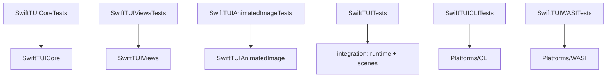

# Development

This document covers building, testing, and releasing SwiftTUI: the toolchain
rules, the gate that every change passes, the fixture policy, and the release
process.

## Toolchains

- **Swift `6.3.1`**, pinned in `.swift-version`. The package builds in Swift 6
  language mode with `.defaultIsolation(.none)` and a set of upcoming features
  enabled (`ExistentialAny`, `InternalImportsByDefault`, and others).
- Use **`swiftly`** to run the toolchain: `swiftly run swift build`,
  `swiftly run swift test`. Building the repo with `xcrun swift` is **not
  supported** — the pinned toolchain is the source of truth.
- **Bun `1.3.13`** orchestrates the test and policy scripts.
- **WASI** builds use the `swift-6.3.1-RELEASE_wasm` SDK.
- When working in a git worktree, keep the final path component `swift-tui` so
  example packages that use `.package(name: "swift-tui", path: "../..")`
  resolve correctly.

## Building and testing

| Command | What it does |
| --- | --- |
| `swiftly run swift build` | Build the package. |
| `bun run test` | The **repo gate** — the bounded suite plus all policy checks. Run this before proposing a change. |
| `bun run test:all` | The exhaustive suite, including slower platform and integration coverage. |
| `bun run test:coverage` | Produce coverage data. Informational — there is no enforced coverage threshold. |
| `bun run perf:list` / `perf:run` / `perf:compare` | Drive the `Tools/TermUIPerf` scenario harness. |

Set `SWIFTTUI_TEST_TIMEOUT_SCALE` to widen async test timeouts on a slow or
loaded machine.

### Test targets



Tests are written with **Swift Testing** (`import Testing`, `@Test`,
`#expect`).

## The repo gate

`bun run test` runs the test suites and a **repo policy phase**. The policy
phase (`Scripts/lib/repo_policy_checks.sh`) runs, in order:

1. **Public-surface policies** (`check_public_surface_policies.sh`) — pins the
   `View`/`Scene`/`App` protocol shape, the actor-isolation surface, the
   absence of retired AnyView and registry seams, and the style-protocol
   policy; also checks that the policy is documented in
   [PUBLIC-API.md](PUBLIC-API.md) and [ARCHITECTURE.md](ARCHITECTURE.md).
2. **Public documentation ratchet** (`check_public_documentation_ratchet.sh`) —
   the curated consumer-facing declarations in
   `Scripts/lib/public_documentation_ratchet.txt` must keep a `///` summary.
3. **Stable doc source paths** (`check_stable_doc_source_paths.sh`).
4. **DocC coverage** (`check_docc_coverage.sh`).
5. **Root test-target coverage** (`check_root_test_target_coverage.sh`).
6. **Rendered text fixture matrix** (`check_rendered_text_fixture_matrix.sh`).
7. **Concurrency-safety policies** (`check_concurrency_safety_policies.sh`) —
   forbids `@unchecked Sendable`, `nonisolated(unsafe)`, and unchecked escape
   hatches.
8. **Accessibility guardrails** (`check_accessibility_guardrails.sh`).
9. **WebHost package boundary** (`check_webhost_package_boundary.sh`).
10. **Public-API baseline** (`generate_public_api_inventory.sh --check`).

### Pre-commit hooks

Hooks run through `prek` (`prek.toml`):

- `swift-format` — formats Swift sources.
- `no-foundation-in-library-products` — `Foundation` imports are forbidden in
  `SwiftTUICore`, `SwiftTUIViews`, and `SwiftTUI`.
- `public-surface-policies`, `structured-concurrency-escape-hatches`,
  `accessibility-guardrails`, `main-thread-usage` — the source-policy checks.

## Rendered text fixtures

Many rendering tests compare against recorded text fixtures. To update them
after an intentional rendering change, run
`Scripts/record_rendered_text_fixtures.sh` locally and commit the result.
Fixture **recording mode must never be enabled in the committed repo state** —
the gate checks for this, because a repo left in recording mode would make the
fixture tests pass unconditionally.

## Public API baseline

`Scripts/generate_public_api_inventory.sh` derives the public-symbol baseline
from `swift package dump-symbol-graph`, classified through
`docs/public_api_overrides.yml`, and writes two committed files:

- `docs/PUBLIC_API_BASELINE.md` — a grouped, human-readable inventory.
- `docs/.public-api-baseline.txt` — a flat sorted list, the machine-grep target.

Run the script with no arguments to regenerate them; run it with `--check` (as
the gate does) to fail when they are stale. Any change that adds or removes a
public symbol must regenerate these files. New public symbols also need a
classification entry in `docs/public_api_overrides.yml`. The prose rationale
for the surface lives in [PUBLIC-API.md](PUBLIC-API.md).

## Releases

SwiftTUI uses plain semantic versioning on a `0.x` alpha line. Consumers depend
on a released tag, not `main`:

```swift
.package(
  url: "https://github.com/SwiftTUI/swift-tui",
  .upToNextMinor(from: "0.1.0")
)
```

`0.1.0` is the first release made under this policy. The earlier `0.0.1` tag
predates it and is a pre-policy artifact.

A release is cut from `main` after the gate passes:

- `bun run test` is green.
- `generate_public_api_inventory.sh --check` is clean — the public-API baseline
  is current.
- The README install snippet names a real released version.
- `LICENSE`, `SECURITY.md`, and `CONTRIBUTING.md` are present and current.

`main` is protected: commits are signed and linear, CI must pass, and changes
land through reviewed pull requests.

## Continuous integration

CI runs on GitHub Actions. The macOS jobs use the `macos-26` runner, which is
the macOS support floor; Linux jobs run on `ubuntu-latest` with a
`swiftly`-managed toolchain. An iOS job builds (but does not run) the
host-compatible products. The browser deployment workflow publishes the
combined DocC archive.
