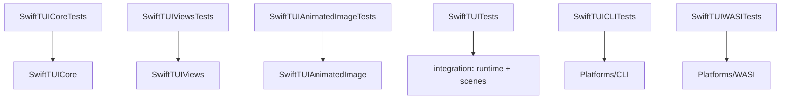

# Development

This document covers building, testing, and releasing SwiftTUI: the toolchain
rules, the gate that every change passes, the fixture policy, and the release
process.

## Toolchains

- **Swift `6.3.1`**, pinned in `.swift-version`. The package builds in Swift 6
  language mode with `.defaultIsolation(.none)` and a set of upcoming features
  enabled (`ExistentialAny`, `InternalImportsByDefault`, and others).
- Use **`swiftly`** to run the toolchain: `swiftly run swift build`,
  `swiftly run swift test`. Building the repo with `xcrun swift` is **not
  supported** — the pinned toolchain is the source of truth.
- **Bun `1.3.13`** orchestrates the test and policy scripts.
- **WASI** builds use the `swift-6.3.1-RELEASE_wasm` SDK.
- Extracted examples resolve the public `swift-tui` release tag by default. Keep
  `swift-tui`, `swift-tui-web`, and `swift-tui-examples` as sibling checkouts
  only when you are deliberately running coordination-local pre-tag integration
  from `swift-tui-org`.

## Building and testing

| Command | What it does |
| --- | --- |
| `swiftly run swift build` | Build the package. |
| `bun run test` | The **repo gate** — the bounded suite plus all policy checks. Run this before proposing a change. |
| `bun run test:all` | The exhaustive suite, including slower platform and integration coverage. |
| `bun run test:coverage` | Produce coverage data. Informational — there is no enforced coverage threshold. |
| `bun run perf:list` / `perf:run` / `perf:compare` | Drive the `Tools/TermUIPerf` scenario harness. |

The runnable example matrix lives in `SwiftTUI/swift-tui-examples`. Its default
gate validates against released public dependencies; use `swift-tui-org` when
you need to test unreleased framework changes against the examples through the
coordination overlay.

Set `SWIFTTUI_TEST_TIMEOUT_SCALE` to widen async test timeouts on a slow or
loaded machine.

The repo gate also has a command-level watchdog around every sub-suite. By
default, `STUI_TEST_STEP_TIMEOUT_SECONDS=1200`; set it to `0` only for local
diagnosis when you intentionally want an unbounded run. On timeout, the runner
prints the captured sub-suite log and exits immediately so later suites do not
keep spending CI minutes.

### Test targets



Tests are written with **Swift Testing** (`import Testing`, `@Test`,
`#expect`).

## The repo gate

`bun run test` runs the test suites and a **repo policy phase**. The policy
phase (`Scripts/lib/repo_policy_checks.sh`) runs, in order:

1. **Public-surface policies** (`check_public_surface_policies.sh`) — pins the
   `View`/`Scene`/`App` protocol shape, the actor-isolation surface, the
   absence of retired AnyView and registry seams, and the style-protocol
   policy; also checks that the policy is documented in
   [PUBLIC-API.md](PUBLIC-API.md) and [ARCHITECTURE.md](ARCHITECTURE.md).
2. **Stable doc source paths** (`check_stable_doc_source_paths.sh`).
3. **DocC coverage** (`check_docc_coverage.sh`) — every `.library` product in
   `Package.swift` ships a DocC catalog. Derived by convention (a directory
   named `<target>.docc`); no manifest.
4. **Root test-target coverage** (`check_root_test_target_coverage.sh`).
5. **Rendered text fixture matrix** (`check_rendered_text_fixture_matrix.sh`).
6. **Concurrency-safety policies** (`check_concurrency_safety_policies.sh`) —
   forbids `@unchecked Sendable`, `nonisolated(unsafe)`, and unchecked escape
   hatches.
7. **WebHost package boundary** (`check_webhost_package_boundary.sh`).
8. **Repository split boundary** (`check_repository_split_boundary.sh`) — keeps
   the main Swift package release anchor and checked-in WebHost bundle intact.
9. **Public-API baseline** (`generate_public_api_inventory.sh --check`) — also
   runs a report-only doc-comment ratchet over the `canonical` surface.

### Pre-commit hooks

Hooks run through `prek` (`prek.toml`):

- `swift-format` — formats Swift sources.
- `no-foundation-in-library-products` — `Foundation` imports are forbidden in
  `SwiftTUICore`, `SwiftTUIViews`, and `SwiftTUI`.
- `public-surface-policies`, `structured-concurrency-escape-hatches`,
  `main-thread-usage` — the source-policy checks.
- `no-ai-coauthors` — the commit-message hook is provided by
  `https://github.com/GoodHatsLLC/no-ai-coauthors` and rejects AI attribution
  trailers.

## Rendered text fixtures

Many rendering tests compare against recorded text fixtures. To update them
after an intentional rendering change, run
`Scripts/record_rendered_text_fixtures.sh` locally and commit the result.
Fixture **recording mode must never be enabled in the committed repo state** —
the gate checks for this, because a repo left in recording mode would make the
fixture tests pass unconditionally.

## Public API baseline

`Scripts/generate_public_api_inventory.sh` derives the public-symbol baseline
from `swift package dump-symbol-graph`, classified through
`docs/public_api_overrides.yml`, and writes two committed files:

- `docs/PUBLIC_API_BASELINE.md` — a grouped, human-readable inventory.
- `docs/.public-api-baseline.txt` — a flat sorted list, the machine-grep target.

Run the script with no arguments to regenerate them; run it with `--check` (as
the gate does) to fail when they are stale. Any change that adds or removes a
public symbol must regenerate these files. New public symbols also need a
classification entry in `docs/public_api_overrides.yml`. The prose rationale
for the surface lives in [PUBLIC-API.md](PUBLIC-API.md).

## Releases

SwiftTUI uses plain semantic versioning on a `0.x` alpha line. Consumers depend
on a released tag, not `main`:

```swift
.package(
  url: "https://github.com/SwiftTUI/swift-tui",
  .upToNextMinor(from: "0.0.3")
)
```

`0.0.1` is the first public pre-release made under this policy.

## Repository split release flow

The Swift release anchor is `SwiftTUI/swift-tui`. Release tags in sibling repos
must reference a released `swift-tui` tag, not an arbitrary branch SHA, unless
the release is an internal preview.

`SwiftTUIWebHost` ships a checked-in browser bundle. When the browser runtime
source changes in `SwiftTUI/swift-tui-web`, update the bundle in `swift-tui`
with `Scripts/update_webhost_bundle.sh --web-checkout ../swift-tui-web`, run
`bun run test`, and commit the resource update with the matching web release
version in the commit message. The script stamps
`Resources/browser/bundle-provenance.json` with the web checkout's revision;
the coordination root's `webhost_bundle_provenance` gate compares that stamp
against the pinned `swift-tui-web` submodule, so a bundle left stale after web
runtime changes fails org CI instead of silently shipping an old runtime.

Runnable examples and the WebExample static demo are validated in
`SwiftTUI/swift-tui-examples`. A fresh examples clone validates against public
release dependencies by default. Use the coordination repo's pre-tag overlay
gates when testing unreleased sibling checkout combinations before tagging.

A release is cut from `main` after the gate passes:

- `bun run test` is green.
- `generate_public_api_inventory.sh --check` is clean — the public-API baseline
  is current.
- The README install snippet names a real released version.
- `LICENSE`, `SECURITY.md`, and `CONTRIBUTING.md` are present and current.

`main` is protected: commits are signed and linear, CI must pass, and changes
land through reviewed pull requests.

## Continuous integration

CI runs on GitHub Actions. The macOS jobs use the `macos-26` runner, which is
the macOS support floor; Linux jobs run on native amd64 and arm64 Ubuntu
runners with a `swiftly`-managed toolchain. An iOS job builds (but does not
run) the host-compatible products. The browser deployment workflow publishes
the combined DocC archive.

The default repo-gate workflow skips the slow public API symbol-graph check and
`Tools/TermUIPerf` package tests. Those run in separate workflows instead:
`Public API Baseline` is path-filtered to public-surface inputs, and
`TermUIPerf Tests` runs when the perf package is touched, on schedule, or by
manual dispatch. The repo-gate matrix summary includes per-lane durations so
slow checks are visible without opening every job log.

The scheduled `Release Soundness Lane` (`.github/workflows/release-soundness.yml`,
nightly + dispatch) is the only **release-configuration** test execution: it
runs the core, runtime, stress, and reconciliation suites under
`swift test -c release` with the soundness probe forced to every frame and
violation tracing on (`Scripts/release_soundness_lane.sh`), so the
release-only behavioral arms — `.trustSoundDamage` raster reuse, delta-checkpoint
trust, the release-checked isolation traps, and the sampled probe oracles —
actually execute somewhere before a tag ships them. The known load-flaky
run-loop suites run serialized in a `continue-on-error` step (an intermittent
red there is flake-#1 signal, not a merge blocker), and a second variant
rebuilds the stress/reconciliation subset with
`-enable-actor-data-race-checks`.

CI jobs also carry workflow-level caps: the Linux repo gate is capped at 45
minutes, the macOS repo gate at 30 minutes, the iOS build at 15 minutes, the
Linux image build at 45 minutes, the Linux image manifest publish at 10
minutes, the perf smoke at 20 minutes, and Cloudflare Pages deployment at 30
minutes.

## Known test flakes

The gate has **no automatic test retries**, and is deterministic by design
(poll-free synchronisation, no in-gate wall-clock budgets). A small number of
tests are nonetheless known to fail spuriously under heavy parallel load. Before
attributing a gate failure to your change, match its signature against
[KNOWN-TEST-FLAKES.md](KNOWN-TEST-FLAKES.md) — the single register of known
flakes and the triage rule for telling a flake from a real regression.
