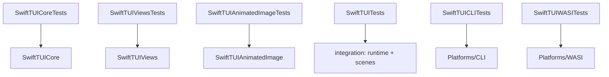

# Development

This document covers building, testing, and releasing SwiftTUI: the toolchain
rules, the gate that every change passes, the fixture policy, and the release
process.

## Toolchains

- **Swift `6.3.3`**, pinned in `.swift-version`. The package builds in Swift 6
  language mode with `.defaultIsolation(.none)` and a set of upcoming features
  enabled (`ExistentialAny`, `InternalImportsByDefault`, and others).
- Use **`swiftly`** to run the toolchain: `swiftly run swift build`,
  `swiftly run swift test`. Building the repo with `xcrun swift` is **not
  supported** — the pinned toolchain is the source of truth.
- **Bun `1.3.13`** orchestrates the test and policy scripts.
- **WASI** builds use the `swift-6.3.3-RELEASE_wasm` SDK.
- Extracted examples resolve the public `swift-tui` release tag by default. Keep
  `swift-tui`, `swift-tui-web`, and `swift-tui-examples` as sibling checkouts
  only when you are deliberately running coordination-local pre-tag integration
  from `swift-tui-org`.

## Building and testing

| Command | What it does |
| --- | --- |
| `swiftly run swift build` | Build the package. |
| `bun run test` | The **repo gate** — the bounded suite plus all policy rules. Run this before you propose a change. |
| `bun run test:all` | The exhaustive suite, including slower platform and integration coverage. |
| `bun run test:coverage` | Produce coverage data. Informational — there is no enforced coverage threshold. |
| `bun run perf:list` / `perf:run` / `perf:compare` | Drive the `Tools/TermUIPerf` scenario harness. |

The runnable example matrix lives in `SwiftTUI/swift-tui-examples`. Its default
gate tests released public dependencies. Use `swift-tui-org` when
you need to test unreleased framework changes against the examples through the
coordination overlay.

Set `SWIFTTUI_TEST_TIMEOUT_SCALE` to widen async test timeouts on a slow or
loaded machine.

### Warnings are errors in the gate

The repo gate builds with `SWIFTTUI_WARNINGS_AS_ERRORS=1`, which turns on
`.treatAllWarnings(as: .error)` for every Swift and C target in
`Package.swift`. A new compiler warning fails `bun run test`, so warnings
cannot accumulate. A plain `swiftly run swift build` leaves them as warnings.
Export the variable yourself to reproduce a gate failure locally:

```bash
SWIFTTUI_WARNINGS_AS_ERRORS=1 swiftly run swift build --build-tests
```

This compiler option is deliberately **opt-in rather than unconditional**. SE-0480 says
warning controls are stripped when a package is consumed as a
dependency, but that guarantee has two holes:

- It does not cover `path:` dependencies, which SwiftPM treats as local. On
  Swift 6.3.1 a consumer with a `path:` dependency inherits
  `-warnings-as-errors` and fails on *our* warnings. `path:` is how the
  `swift-tui-org` coordination overlay and Xcode's "Add Local Package…" consume
  this repo.
- The stripping itself shipped broken:
  [swiftlang/swift-package-manager#9517](https://github.com/swiftlang/swift-package-manager/issues/9517)
  had the substituted `-suppress-warnings` collide with `-warnings-as-errors`
  as `error: conflicting options`. Reported against Swift 6.3.0, fixed only in
  March 2026 snapshots. Consumers on an older toolchain did not build at all.

`.unsafeFlags(["-warnings-as-errors"])` is strictly worse than either: SwiftPM
refuses a package that uses unsafe flags as a versioned dependency outright.

Never make the compiler option unconditional. Add it to a gate lane instead.

The repo gate also has a command-level watchdog around every sub-suite. By
default, `SWIFTTUI_TEST_STEP_TIMEOUT_SECONDS=1200`. That bounds **silence, not
total runtime**: the watchdog fires when a sub-suite has produced no output for
that long. A fixed wall-clock cap could not tell a lane that parked from one
merely running slower under contention, and killed both — the failure mode
recorded as [KNOWN-TEST-FLAKES.md](KNOWN-TEST-FLAKES.md) entry 9. Set it to `0`
only for local diagnosis when you intentionally want an unbounded run.
`SWIFTTUI_TEST_STEP_ABSOLUTE_TIMEOUT_SECONDS` (default: 4× the idle bound, `0`
disables) is the backstop for the one case silence cannot catch, a sub-suite
that livelocks while still printing. On timeout, the runner prints the captured
sub-suite log and exits immediately so later suites do not keep spending CI
minutes.

`Scripts/check_step_watchdog.sh` is the watchdog's self-test: it drives the real
`run_logged_command` with synthetic slow, silent, and chatty-livelock steps, so
the behaviour is verified deterministically in seconds rather than only on a
loaded runner.

### Test targets


```mermaid
flowchart TD
    core["SwiftTUICoreTests"] --> coreT["SwiftTUICore"]
    views["SwiftTUIViewsTests"] --> viewsT["SwiftTUIViews"]
    img["SwiftTUIAnimatedImageTests"] --> imgT["SwiftTUIAnimatedImage"]
    root["SwiftTUITests"] --> rootT["integration: runtime + scenes"]
    cli["SwiftTUICLITests"] --> cliT["Platforms/CLI"]
    wasi["SwiftTUIWASITests"] --> wasiT["Platforms/WASI"]
```

Tests are written with **Swift Testing** (`import Testing`, `@Test`,
`#expect`).

## The repo gate

`bun run test` runs the test suites and a **repo policy phase**. The policy
phase (`Scripts/lib/repo_policy_checks.sh`) runs, in order:

1. **Public-surface policies** (`check_public_surface_policies.sh`) — pins the
   `View`/`Scene`/`App` protocol shape, the actor-isolation surface, the
   absence of retired AnyView and registry seams, and the style-protocol
   policy. It also makes sure that the policy is documented in
   [PUBLIC-API.md](PUBLIC-API.md) and [ARCHITECTURE.md](ARCHITECTURE.md).
2. **Documentation-cited paths and claims** (`check_doc_cited_paths.sh`) —
   requires cited repository paths to exist and ratchets retired architecture
   claims against an exact burn-down ledger.
3. **DocC coverage** (`check_docc_coverage.sh`) — every `.library` product in
   `Package.swift` ships a DocC catalog. The script derives this list by
   convention from directories named `<target>.docc`. There is no manifest.
4. **Root test-target coverage** (`check_root_test_target_coverage.sh`).
5. **Rendered text fixture matrix** (`check_rendered_text_fixture_matrix.sh`).
6. **Concurrency-safety policies** (`check_concurrency_safety_policies.sh`) —
   forbids `@unchecked Sendable`, `nonisolated(unsafe)`, and unchecked escape
   hatches.
7. **WebHost package boundary** (`check_webhost_package_boundary.sh`).
8. **Repository split boundary** (`check_repository_split_boundary.sh`) — keeps
   the main Swift package release anchor and committed WebHost bundle intact.
9. **Public-API baseline** (`generate_public_api_inventory.sh --check`) — also
   runs a report-only doc-comment ratchet over the `canonical` surface.

### Pre-commit hooks

Hooks run through `prek` (`prek.toml`):

- `swift-format` — formats Swift sources.
- `no-foundation-in-library-products` — `Foundation` imports are forbidden in
  `SwiftTUICore`, `SwiftTUIViews`, and `SwiftTUI`.
- `public-surface-policies`, `structured-concurrency-escape-hatches`,
  `main-thread-usage` — the source-policy rules.
- `no-ai-coauthors` — the commit-message hook is provided by
  `https://github.com/GoodHatsLLC/no-ai-coauthors` and rejects AI attribution
  trailers.

## Rendered text fixtures

Many rendering tests compare against recorded text fixtures. To update them
after an intentional rendering change, run
`Scripts/record_rendered_text_fixtures.sh` locally and commit the result.
Fixture **recording mode must never be enabled in the committed repo state**.
The gate makes sure that recording mode is off. A repo left in recording mode
makes the fixture tests pass unconditionally.

## Transport wire fixtures

`Fixtures/Transport/` holds the wire fixtures shared with the sibling host
repos: `swift-tui-web` mirrors the web-surface, terminal-style, and full
conformance corpus in its own `Fixtures/Transport/`. `swift-tui-android`
mirrors the generated `web-surface-totality` and
`web-surface-composited-image` records plus that same full conformance corpus
in its test resources. The coordination root's `//:transport_fixture_sync` gate
byte-compares every mirrored copy, so a wire-contract change here goes red in
org CI until the sibling copies are re-synced. The totality and
composited-image fixtures are generated. After an intentional wire change, run
their pin tests with `SWIFTTUI_REGENERATE_TRANSPORT_FIXTURES=1`. Copy the results
to the sibling repos. Commit all sides. The hand-authored
fixtures (`web-surface-basic/styled`, terminal style) are edited in place and
copied the same way.

The versioned host-wire conformance corpus is
`Fixtures/Transport/conformance-manifest.json` plus every declared
`conformance-*.jsonl` body. Record it only through the real Swift encoder:

```bash
Scripts/record_host_wire_conformance_fixtures.sh
```

The recorder recomputes the exact manifest and body SHA-256 values. Its test
then reloads the corpus through the strict schema and census validator. Do not edit
recorded `emit` bytes. The sole exception is the named unknown-token scenario,
whose recorder performs one explicit token substitution after production
encoding. Structured row expectations are decoded back from those production
records instead of being authored independently. Review the byte diff. Run the
recorder test again with recording disabled. Before the coordination root's
fixture-sync gate, copy the manifest and **every** conformance body byte-for-byte
to both consumer repos. S5 has
active `s1`/`s2` scenarios, parseable but inactive `s3a`/`s3b` host-adapter
scenarios, and intentionally no `s3d` fixture until the real post-S3d encoder
exists. The inactive Swift adapters still compile and their meta-tests interpret
the real Android copy ABI and WebSocket channel/input seams. Adding the binding
stage to an adapter's implemented-stage set makes its full fixture mandatory.
The repo gate rejects
`SWIFTTUI_REGENERATE_CONFORMANCE_FIXTURES` so recording cannot mask drift.

## Public API baseline

`Scripts/generate_public_api_inventory.sh` derives the public-symbol baseline
from `swift package dump-symbol-graph`, classified through
`docs/public_api_overrides.yml`, and writes three committed files:

- `docs/PUBLIC_API_BASELINE.md` — a grouped, human-readable inventory.
- `docs/.public-api-baseline.txt` — a flat sorted list, the machine-grep target.
- `docs/.spi-api-baseline.txt` — the flat SPI-only surface (a second,
  SPI-inclusive dump minus the public dump). `@_spi(Runners)` is the host
  contract the swiftui/web/android host repos consume, so changes here must
  be coordinated with those repos. The baseline makes an SPI break a visible
  diff instead of a silent downstream failure.

Run the script with no arguments to regenerate them. Run it with `--check`, as
the gate does) to fail when they are stale. Any change that adds or removes a
public symbol must regenerate these files. Every new shipped-product symbol
also needs an explicit classification in `docs/public_api_overrides.yml`.
Otherwise, it enters `pending-review` and `--check` fails. Module defaults are
reserved for the uniformly package-only and test-support modules, while the SPI
baseline remains classification-free.

When retiring a module default or moving declarations, preserve the committed
baseline's effective classifications by materializing the missing explicit
entries for review:

```bash
bun run Scripts/lib/materialize_override_entries.ts \
  --baseline docs/PUBLIC_API_BASELINE.md \
  --overrides docs/public_api_overrides.yml \
  --module SwiftTUIRuntime
```

Add `--check` to make sure that every selected baseline entry is explicit.
The helper only reports YAML entries. It never edits the ledger. The prose
rationale for the surface lives in [PUBLIC-API.md](PUBLIC-API.md).

## Releases

SwiftTUI uses plain semantic versioning on a `0.x` alpha line. Consumers depend
on a released tag, not `main`:

```swift
.package(
  url: "https://github.com/SwiftTUI/swift-tui",
  .upToNextMinor(from: "0.0.3")
)
```

`0.0.1` is the first public pre-release made under this policy.

## Repository split release flow

The Swift release anchor is `SwiftTUI/swift-tui`. Release tags in sibling repos
must reference a released `swift-tui` tag, not an arbitrary branch SHA, unless
the release is an internal preview.

`SwiftTUIWebHost` ships a committed browser bundle. When the browser runtime
source changes in `SwiftTUI/swift-tui-web`, update the bundle in `swift-tui`
with `Scripts/update_webhost_bundle.sh --web-checkout ../swift-tui-web`. Then run
`bun run test`. Commit the resource update with the matching web release version
in the commit message. The script stamps
`Resources/browser/bundle-provenance.json` with the web checkout's revision.
The coordination root's `webhost_bundle_provenance` gate compares that stamp
against the pinned `swift-tui-web` submodule. A stale bundle fails org CI, so it
cannot silently ship an old runtime after web runtime changes.

Runnable examples and the WebExample static demo are tested in
`SwiftTUI/swift-tui-examples`. A fresh examples clone tests public
release dependencies by default. Use the coordination repo's pre-tag overlay
gates when testing unreleased sibling checkout combinations before tagging.

A release is cut from `main` after the gate passes:

- `bun run test` is green.
- `generate_public_api_inventory.sh --check` is clean — the public-API baseline
  is current.
- The README install snippet names a real released version.
- `LICENSE`, `SECURITY.md`, and `CONTRIBUTING.md` are present and current.

`main` is protected: commits are signed and linear, CI must pass, and changes
land through reviewed pull requests.

## Continuous integration

CI runs on GitHub Actions. The macOS jobs use the `macos-26` runner, which is
the macOS support floor. Linux jobs run on native amd64 and arm64 Ubuntu
runners with a `swiftly`-managed toolchain. An iOS job builds (but does not
run) the host-compatible products. The browser deployment workflow publishes
the combined DocC archive.

The default repo-gate workflow skips the slow public API symbol-graph test and
`Tools/TermUIPerf` package tests. Separate workflows run them. The
`Public API Baseline` workflow is path-filtered to public-surface inputs. The
`TermUIPerf Tests` workflow runs when the perf package is touched, on schedule,
or by manual dispatch. The repo-gate matrix summary includes per-lane durations so
slow tests are visible without opening every job log.

The scheduled `Release Soundness Lane` (`.github/workflows/release-soundness.yml`,
nightly + dispatch) is the only **release-configuration** test execution. It
runs the core, runtime, stress, and reconciliation suites under
`swift test -c release`. It forces the soundness probe to every frame and turns
on violation tracing (`Scripts/release_soundness_lane.sh`). Thus, it executes
the release-only behavioral arms before a tag ships them. These arms include
`.trustSoundDamage` raster reuse, delta-checkpoint trust, the release-checked
isolation traps, and the sampled probe oracles. The known load-flaky
run-loop suites run serialized in a `continue-on-error` step (an intermittent
red there is flake-#1 signal, not a merge blocker), and a second variant
rebuilds the stress/reconciliation subset with
`-enable-actor-data-race-checks`.
The canonical [soundness oracle map](SOUNDNESS-ORACLES.md) records each
invariant's enforcement, sampling, failure channel, owning tests, and residual
status. The normal repository policy phase fails if that map drifts from the
probe source.

CI jobs also have these workflow-level caps:

- Linux repo gate: 45 minutes.
- macOS repo gate: 30 minutes.
- iOS build: 15 minutes.
- Linux image build: 45 minutes.
- Linux image manifest publish: 10 minutes.
- Perf smoke: 20 minutes.
- Cloudflare Pages deployment: 30 minutes.

## Known test flakes

The gate has **no automatic test retries**, and is deterministic by design
(poll-free synchronisation, no in-gate wall-clock budgets). A small number of
tests are nonetheless known to fail spuriously under heavy parallel load. Before
you attribute a gate failure to your change, open
[KNOWN-TEST-FLAKES.md](KNOWN-TEST-FLAKES.md). Match the signature against this
single register of known flakes. It also gives the triage rule that separates a
flake from a real regression.
