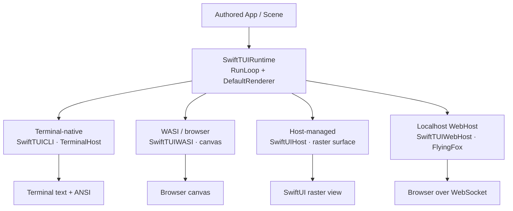
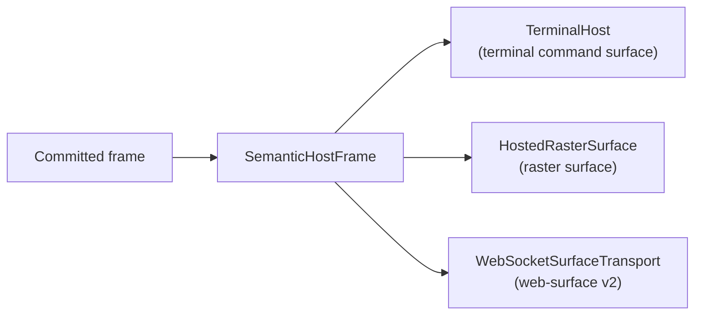
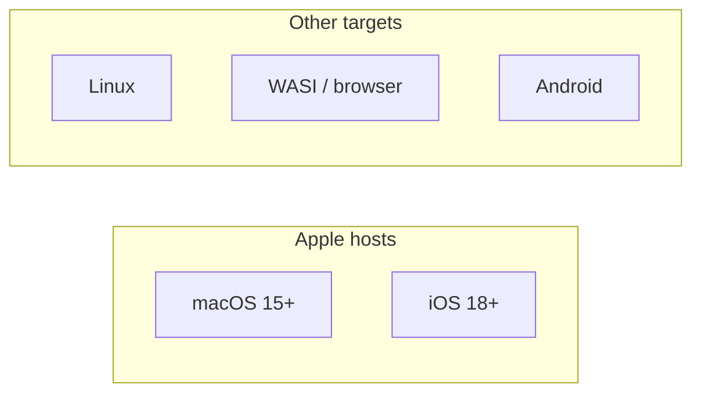

# Hosts and Platforms

The render pipeline ([RENDER-PIPELINE.md](RENDER-PIPELINE.md)) produces a
committed frame. A **host** presents that frame. The same authored app can run
under four different hosts; the pipeline above them is identical.

## The four execution modes

| Mode | Product | Presents to | Notes |
| --- | --- | --- | --- |
| Terminal-native | `SwiftTUICLI` (`TerminalRunner`) | A real terminal via `TerminalHost` | Explicit terminal-only runner. The default `SwiftTUI` import reaches terminal launch through `SwiftTUIWebHostCLI`. |
| WASI / browser | `SwiftTUIWASI` (`WASIRunner`) | A browser canvas | Swift compiled to WASI; raster output drawn onto a canvas via the `web-surface` transport. |
| Host-managed | `SwiftUIHost` | A `SwiftUI` view inside an app | Retains `HostedSceneSession` values and draws a `HostedRasterSurface`. macOS-only. |
| Localhost WebHost | `SwiftTUIWebHost` (`WebHostRunner`) | A browser, served by the native process | The process runs an embedded HTTP/WebSocket server (FlyingFox) and drives a bundled browser runtime over the `web-surface` v2 protocol. |

A binary can support more than one mode. `SwiftTUIWebHostCLI` (`WebHostCLIRunner`)
combines terminal-native and localhost-browser launch in one executable;
`--web` selects the WebHost path. The `SwiftTUI` convenience product includes
that combined runner by default.

## The host-frame contract

Hosts do not see the pipeline. They see a committed frame through a small set
of focused contracts.

- **`SemanticHostFrame`** — the value `RunLoop.presentCommittedFrame` builds for
  every host. It carries the raster surface, the commit plan, and the semantic
  snapshot.
- **`PresentationSurface` roles** — a host adopts only the roles it needs:
  - `PresentationSurfaceMetricsProvider` — reports surface size and metrics.
  - `TerminalCommandPresentationSurface` — accepts terminal command output.
  - `RasterPresentationSurface` — accepts a raster surface.
  - `DamageAwarePresentationSurface` — accepts incremental damage regions.
  - `SemanticHostFramePresentationSurface` — accepts the full semantic frame.

`TerminalHost` (and `WebTerminalHost`) consume terminal command output;
`HostedRasterSurface` consumes a raster surface; `WebSocketSurfaceTransport`
serializes the `web-surface` v2 wire frame for the browser. Each conforms to
the host-frame surface protocols rather than reaching into the renderer.

## The terminal host

`TerminalHost` is the POSIX terminal host.

- **Output** is written by a `PresentationWriter` on a private serial
  `DispatchQueue`, so a blocking `write(2)` never stalls the run loop. Stale
  frames are dropped with a `forceFullRepaint` recovery path.
- **Graphics capabilities** are re-probed each frame:
  `baselineGraphicsCapabilities` re-reads the cell pixel size via
  `ioctl(TIOCGWINSZ)`, so a resize is picked up without a separate query.
- **Crash safety** is the runner's job, not the framework's. `CrashSignalHandler`
  (from the vendored `UnixSignals`) is installed by the CLI runner so a crash
  restores the terminal; `SwiftTUICore` and `SwiftTUIRuntime` install no signal
  handlers.

## Platform support matrix

| Surface | Status |
| --- | --- |
| macOS package development and CI | Primary supported Apple-host path. GitHub `macos-26` is the macOS CI floor. |
| Linux terminal builds and tests | Supported through `swiftly`. |
| iOS package builds | Supported for host-compatible products; CI builds (does not run tests). PTY/terminal-embedding products are excluded. |
| WASI / browser | Supported through `SwiftTUIWASI` and the `Platforms/Web` browser packages. |
| Android cross-compilation | `aarch64` builds with the Swift Android SDK. `x86_64` currently fails inside the vendored `swift-png` SIMD path — see [VISION-GAP.md](VISION-GAP.md). |
| `SwiftTUITerminal` / `SwiftTUIPTYPrimitives` (PTY embedding) | macOS and Linux only. |
| `SwiftUIHost` | macOS only; excluded from Linux at compile time. |

The package declares `macOS 15` and `iOS 18` platforms unless the build sets
`DISABLE_EXPLICIT_PLATFORMS=1` (Linux CI does, to skip the Apple platform
restriction).

## The web packages

The browser deployment story spans Swift and TypeScript:

- **`SwiftTUIWASI`** — the Swift runner that builds for WASI and exposes the
  manifest plus hosted-session story.
- **`Platforms/Web`** (`@swifttui/web`) — the browser runtime that hosts a WASI
  build, drawing raster output onto a canvas via the `web-surface` transport.
- **`Platforms/WebBuild`** (`@swifttui/build`) — TypeScript build helpers for
  manifest generation, WASI builds, wasm validation, and static packaging.
- **`SwiftTUIWebHost`** — the native localhost-browser host; serves the browser
  runtime over an embedded server instead of compiling the app to WASI.

`Platforms/Web` and `Platforms/WebBuild` are Bun workspace packages, not Swift
package products.

## Terminal-program embedding

SwiftTUI can embed a real child terminal program as authored content — a
deliberate terminal-native capability (see [VISION.md](VISION.md)).

- **`TerminalView<Session>`** is an ordinary `View`. It hosts a
  `TerminalSession`; `TerminalProcessSession` is the built-in implementation
  that runs a child process over a pty (`ChildProcessPty`).
- The embedded program's grid is blitted into the surrounding frame as a
  `DrawCommand.foreignSurface`, which the rasterizer paints like any other draw
  command.
- The emulator handles OSC 0/2 (title), OSC 7 (working directory), OSC 8
  (hyperlinks), OSC 52 (clipboard), bracketed paste, and mouse-mode
  translation.
- **`SwiftTUITerminalWorkspace`** layers tabbed and split-pane composition
  (`TerminalWorkspaceView`, `TerminalWorkspaceState`, layout, and a session
  store) above `TerminalView`.

Sixel/Kitty graphics inside embedded panes, the Kitty keyboard protocol, OSC 99
notification namespacing, and process reattachment after an app restart are not
implemented — see [VISION-GAP.md](VISION-GAP.md).
