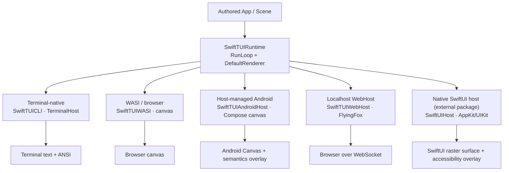
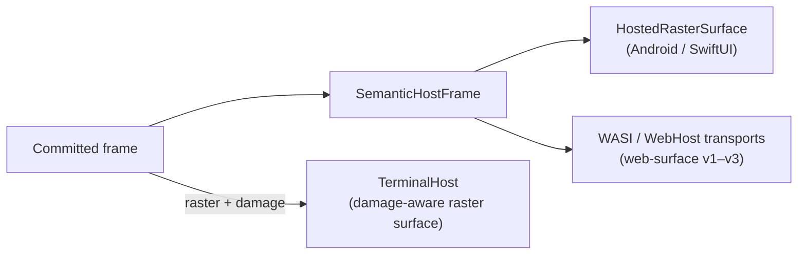
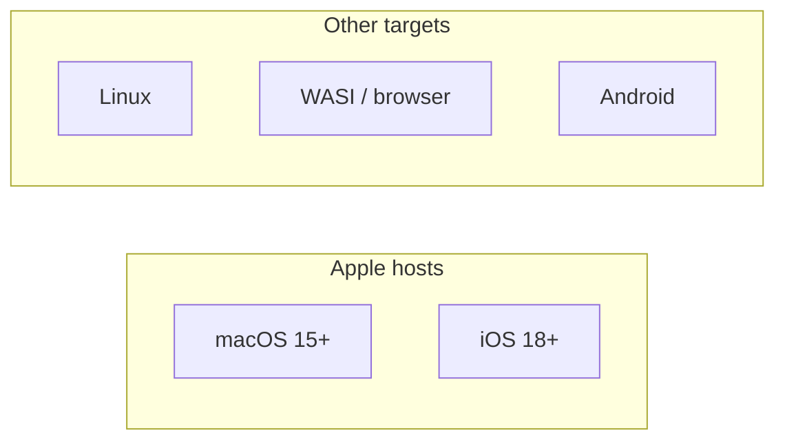

# Hosts and Platforms

The render pipeline
([DocC source](../Sources/SwiftTUIRuntime/SwiftTUIRuntime.docc/Runtime-Render-Pipeline.md))
produces a committed frame. A **host** presents that frame. This document owns
the canonical matrix. This package contains four execution modes. The native
SwiftUI host ships separately, for five host presentations in total. They
share the phase ordering and committed-frame contracts. Resolve reuse,
evaluation, and stack behavior vary by the
[per-host engine profile](#per-host-engine-profiles).

## Canonical host matrix

```mermaid
flowchart TD
    app["Authored App / Scene"]
    runtime["SwiftTUIRuntime<br/>RunLoop + DefaultRenderer"]
    app --> runtime

    runtime --> term["Terminal-native<br/>SwiftTUICLI · TerminalHost"]
    runtime --> wasi["WASI / browser<br/>SwiftTUIWASI · canvas"]
    runtime --> androidHost["Host-managed Android<br/>SwiftTUIAndroidHost · Compose canvas"]
    runtime --> web["Localhost WebHost<br/>SwiftTUIWebHost · FlyingFox"]
    runtime --> swiftui["Native SwiftUI host (external package)<br/>SwiftUIHost · AppKit/UIKit"]

    term --> termOut["Terminal text + ANSI"]
    wasi --> wasiOut["Browser canvas"]
    androidHost --> androidOut["Android Canvas + semantics overlay"]
    web --> webOut["Browser over WebSocket"]
    swiftui --> swiftuiOut["SwiftUI raster surface + accessibility overlay"]
```

| Mode | Product | Presents to | Notes |
| --- | --- | --- | --- |
| Terminal-native | `SwiftTUICLI` (`TerminalRunner`) | A real terminal via `TerminalHost` | Explicit terminal-only runner. The default `SwiftTUI` import reaches terminal launch through `SwiftTUIWebHostCLI`. |
| WASI / browser | `SwiftTUIWASI` (`WASIRunner`) | A browser canvas | Swift compiled to WASI. Raster output drawn onto a canvas via the `web-surface` transport. Uses the [stack-lean resolve profile](#per-host-engine-profiles) by default. |
| Host-managed Android | `SwiftTUIAndroidHost` | An Android Compose view inside an app | Retains `HostedSceneSession` values behind a JNI/C ABI and serializes committed frames as web-surface records (the converged wire). Draws styled cells/images plus a semantics overlay in Compose. The Swift host cross-compiles for arm64 and x86_64. The current `AndroidGallery` packages arm64 only. |
| Localhost WebHost | `SwiftTUIWebHost` (`WebHostRunner`) | A browser, served by the native process | The process runs an embedded HTTP/WebSocket server (FlyingFox) and drives a bundled browser runtime over the `web-surface` protocol (v1/v2 full frames, v3 delta frames). |
| Native SwiftUI host (external package) | `SwiftUIHost` from [`swift-tui-swiftui`](https://github.com/SwiftTUI/swift-tui-swiftui) | A SwiftUI view on macOS or iOS | Retains the same runtime sessions. Presents raster, damage, focus, and accessibility through AppKit/UIKit-backed SwiftUI views. Bridges input plus clipboard writes back to the runtime. It is not a product of this package. |

A binary can support more than one mode. `SwiftTUIWebHostCLI` (`WebHostCLIRunner`)
combines terminal-native and localhost-browser launch in one executable.
`--web` selects the WebHost path. The `SwiftTUI` convenience product includes
that combined runner by default.

### Where host code lives

The in-package integration code lives under `Platforms/`: terminal launch,
WASI, localhost WebHost, Android, and shared embedding contracts are SwiftPM
targets here. Hosts are partitioned across repositories by **distribution
contract**, not by backend. A host in another package ecosystem keeps that half
in a dedicated sibling repository. These repositories are
`SwiftTUI/swift-tui-web` (Bun/npm) and `SwiftTUI/swift-tui-android`
(Gradle/Maven AAR + plugin). Tagged releases or released artifacts couple them
back to this package. The Apple-SDK-gated `SwiftUIHost` product is
wholly external, in
[`SwiftTUI/swift-tui-swiftui`](https://github.com/SwiftTUI/swift-tui-swiftui).
These boundaries keep foreign package managers and Apple-only framework
imports out of this core SwiftPM package.

### Per-host engine profiles

The host boundary stays shared, but resolve has two profiles. “Full” means that
the retained-reuse door is eligible. Memoized-body reuse is eligible for its
`Equatable` opt-ins. Selective dirty-frontier evaluation can run after the boot
frame. It does not promise a reuse hit: invalidation,
suppression, churn, and each reuse door's normal guards still decide that.

| Host presentation | Default resolve profile |
| --- | --- |
| Terminal-native | Full/native |
| Localhost WebHost | Full/native — the Swift runtime is a native server process even though presentation is in a browser. |
| Host-managed Android | Full/native |
| Native SwiftUI host | Full/native |
| WASI / browser | Stack-lean |

The full/native profile uses the normal `TaskLocal` context bindings. It keeps
retained and memoized resolve reuse available. It enables selective evaluation
after the first full render and leaves `DeferredResolveDriver.depthLimit` unset
by default.

The stack-lean profile preserves the same phase products and committed-frame
contract while changing resolve mechanics to fit constrained WebAssembly
stacks:

- Retained and memoized resolve reuse are disabled by default. Selective
  evaluation is also disabled, so frames enter resolve from the root.
- The three synchronous per-level bindings — ambient environment, authoring
  context, and view-node context — use MainActor-scoped save/restore slots
  instead of `TaskLocal.withValue`. Async bindings remain task-local because
  they can suspend.
- `DeferredResolveDriver` sets the inline depth limit to K=6. Cuts occur only
  at structural child edges, so modifier or chrome chains can overshoot the
  limit before deferral. The driver queues cut subtrees after the stack unwinds
  and reruns resolve to a bottom-up fixpoint, preserving ancestor value
  post-processing rather than patching committed values.

`SWIFTTUI_STACK_LEAN_PROFILE` overrides the platform default in both
directions. A value of `0` gives a WASI process the full profile. A value of `1`
gives a native process the exact stack-lean shape for parity tests and debugging.
`SWIFTTUI_LEAN_RETAINED_REUSE=1` sets the package's `leanRetainedReuse` knob
when lean mode is active. It re-enables only retained reuse, whose hits
short-circuit and therefore shallow the descent. Memoized reuse and selective
evaluation remain off. For stack-budget diagnosis,
`SWIFTTUI_RESOLVE_DEPTH_LIMIT=<positive integer>` replaces K=6 and also
force-enables deferred resolve under the full/native profile. A parsed
non-positive value disables the driver.

## The host-frame contract

Hosts do not see the pipeline. They see a committed frame through a small set
of focused contracts.

- **`SemanticHostFrame`** — the value `RunLoop.presentCommittedFrame` builds
  when a surface adopts `SemanticHostFramePresentationSurface`. It carries the
  raster, semantic snapshot, focused identity, host-facing damage, preferred
  layout size, and a producer sequence.
- **`PresentationSurface` roles** — a host adopts only the roles it needs:
  - `PresentationSurfaceMetricsProvider` — reports surface size and metrics.
  - `TerminalCommandPresentationSurface` — accepts terminal command output.
  - `RasterPresentationSurface` — accepts a raster surface.
  - `DamageAwarePresentationSurface` — accepts incremental damage regions.
  - `SemanticHostFramePresentationSurface` — accepts the full semantic frame.

| Host | Damage consumption |
| --- | --- |
| Terminal-native | `TerminalHost` uses damage to limit row/span diffing and terminal byte emission. |
| WASI / browser | `WebSurfaceTransport` serializes damage into the web-surface frame. The browser canvas clears and redraws dirty rects only. |
| Localhost WebHost | `WebSocketSurfaceTransport` serializes the same web-surface damage over WebSocket. |
| Host-managed Android | `SwiftTUIAndroidHost` serializes the same web-surface damage object (the converged wire). The Compose renderer keeps a retained bitmap and repaints only the damaged rows when consumption is contiguous, falling back to a full repaint otherwise (size change, full-repaint flag, images present, or a skipped render). |
| Native SwiftUI host | `SwiftUIHost` converts damage into AppKit/UIKit dirty rectangles when text and graphics can be replayed incrementally, and requests a full redraw otherwise. |

```mermaid
flowchart LR
    commit["Committed frame"]
    shf["SemanticHostFrame"]
    commit -->|raster + damage| t["TerminalHost<br/>(damage-aware raster surface)"]
    commit --> shf
    shf --> r["HostedRasterSurface<br/>(Android / SwiftUI)"]
    shf --> w["WASI / WebHost transports<br/>(web-surface v1–v3)"]
```

`TerminalHost` takes the damage-aware raster path (and consumes terminal
command output for non-TUI modes). It does not receive a `SemanticHostFrame`.
`HostedRasterSurface`, `WebSurfaceTransport`, and
`WebSocketSurfaceTransport` adopt the semantic host-frame role. The two web
transports serialize the `web-surface` wire frame. Full frames are wire v1
(base) or v2 (sequence/accessibility/scroll fields). When delta emission is
enabled (`SWIFTTUI_SURFACE_DELTA`, which the browser WASI bridge sets) and a
raster damage diff exists, steady-state frames ship as v3 `deltaRows` patches
against the previously presented surface instead. Each transport conforms to
the host-frame surface protocols rather than reaching into the renderer.

Hosts declare wire capabilities through one Swift-side currency
(`HostWireCapabilities`) with one ingress per transport. Its only field at
`HEAD` is the named `acceptsDeltaFrames` bit. Absence keeps the default
full-frame bytes. WASI resolves `SWIFTTUI_SURFACE_DELTA` at transport
construction and ignores runtime `caps` input. After open, the browser WebSocket
client sends a `caps:{json}` control record. The server accepts every declaration
as a new connection epoch and re-anchors all cross-frame encoding
state. Android accepts `declareCapabilities` only before scene start. The
retired `SWIFTTUI_SURFACE_MAX_VERSION` key is inert: record versions describe
shapes and are not negotiated ceilings. The canonical field/ingress manifest
is `HostWireSchema.capabilityMappings`. The normative state and delivery rules
are in [HOST-WIRE-CONTRACT.md](HOST-WIRE-CONTRACT.md).

### Shared Raster Damage Contract

All raster frontends consume the same damage contract: `RasterSurface` plus
optional `PresentationDamage`.

- `nil` damage means full repaint.
- non-`nil` empty damage means no visible raster cells changed.
- non-`nil` row/range damage is relative to the previous `RasterSurface`
  actually presented by the same runtime/frontend pair.

`RunLoop` derives this host-facing value from the frontend's presented raster
history instead of forwarding private retained-layout invalidation or stale
renderer artifact damage. Frontends must not reinterpret retained-layout
invalidation as frontend damage. If stale cells appear after this contract is
satisfied, the bug belongs to that frontend's damage consumer.

## The terminal host

`TerminalHost` is the POSIX terminal host.

- **Output** is written by a `PresentationWriter` on a private serial
  `DispatchQueue`, so a blocking `write(2)` never stalls the run loop. Stale
  frames are dropped with a `forceFullRepaint` recovery path.
- **Graphics capabilities** are re-probed each frame:
  `baselineGraphicsCapabilities` re-reads the cell pixel size via
  `ioctl(TIOCGWINSZ)`, so a resize is picked up without a separate query.
- **Crash safety** is the runner's job, not the framework's. `CrashSignalHandler`
  (from the vendored `SwiftTUIVendorUnixSignals`) is installed by the CLI runner so a crash
  restores the terminal. `SwiftTUICore` and `SwiftTUIRuntime` install no signal
  handlers.

## Platform support matrix

```mermaid
flowchart LR
    subgraph apple["Apple hosts"]
        macos["macOS 15+"]
        ios["iOS 18+"]
    end
    subgraph other["Other targets"]
        linux["Linux"]
        wasi2["WASI / browser"]
        android["Android"]
    end
```

| Surface | Status |
| --- | --- |
| macOS package development and CI | Primary supported Apple-host path. GitHub `macos-26` is the macOS CI floor. |
| Linux terminal builds and tests | Supported through `swiftly`. |
| iOS package builds | Supported for host-compatible products. CI builds (does not run tests). PTY/terminal-embedding products are excluded. |
| WASI / browser | Supported through `SwiftTUIWASI` and the `SwiftTUI/swift-tui-web` browser packages. |
| Android host / cross-compilation | `SwiftTUIAndroidHost` cross-compiles for both `aarch64-unknown-linux-android28` and `x86_64-unknown-linux-android28`. The vendored `swift-png`/`JPEG` image path builds for x86_64, so the earlier SIMD blocker no longer applies. The reusable Compose host + JNI shim ship as the published `sh.swifttui:android-host` AAR, with the `sh.swifttui.android` Gradle plugin, from `SwiftTUI/swift-tui-android`. Consumer apps depend on the tagged `SwiftTUIAndroidHost` SwiftPM product over HTTPS and let the plugin cross-build their Swift host. The `swift-tui-examples/AndroidGallery` Compose app packages and exercises `arm64-v8a` — see [VISION-GAP.md](VISION-GAP.md). |
| Native SwiftUI host | Supported on macOS 15+ and iOS 18+ by the external [`swift-tui-swiftui`](https://github.com/SwiftTUI/swift-tui-swiftui) package. |
| `SwiftTUITerminal` / `SwiftTUIPTYPrimitives` (PTY embedding) | macOS and Linux only. |

The package declares `macOS 15` and `iOS 18` platforms unless the build sets
`DISABLE_EXPLICIT_PLATFORMS=1` (Linux CI does, to skip the Apple platform
restriction).

## The web packages

The Swift products that run browser surfaces live in this repo:
`SwiftTUIWASI`, `SwiftTUIWebHost`, and `SwiftTUIWebHostCLI`.

The WASI browser worker owns stdin and timer readiness for Swift code compiled
to WASI. Its `poll_oneoff` adapter blocks on `SharedArrayBuffer`/`Atomics`
instead of polling from JavaScript. It must wake for clock deadlines, stdin
readability, resize/style control messages, and queue closure.

Browser TypeScript source lives in `SwiftTUI/swift-tui-web` as
`@swifttui/web` and `@swifttui/build`. `SwiftTUIWebHost` consumes a committed
browser bundle under `Platforms/WebHost/Sources/SwiftTUIWebHost/Resources/browser`
so Swift package consumers do not need Bun or npm for localhost WebHost use.

## Terminal-program embedding

SwiftTUI can embed a real child terminal program as authored content — a
deliberate terminal-native capability (see [VISION.md](VISION.md)).

- **`TerminalView<Session>`** is an ordinary `View`. It hosts a
  `TerminalSession`. `TerminalProcessSession` is the built-in implementation
  that runs a child process over a pty (`ChildProcessPty`).
- The embedded program's grid is blitted into the surrounding frame as a
  `DrawCommand.foreignSurface`, which the rasterizer paints like any other draw
  command.
- The emulator handles OSC 0/2 (title), OSC 7 (working directory), OSC 8
  (hyperlinks), OSC 52 (clipboard), bracketed paste, and mouse-mode
  translation.
- **`SwiftTUITerminalWorkspace`** layers tabbed and split-pane composition
  (`TerminalWorkspaceView`, `TerminalWorkspaceState`, layout, and a session
  store) above `TerminalView`.

Sixel/Kitty graphics inside embedded panes, the Kitty keyboard protocol, and OSC
99 notification namespacing are not implemented. Process reattachment after an
app restart is also unavailable. See [VISION-GAP.md](VISION-GAP.md).
