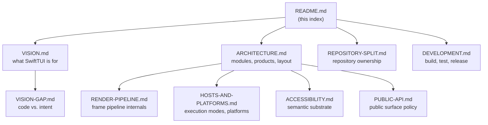

# SwiftTUI Documentation

SwiftTUI is a SwiftUI-shaped UI framework for the terminal, written in Swift.
You author `View` values the same way you would for SwiftUI; SwiftTUI resolves,
lays out, and renders them as terminal text, a browser canvas, or a raster
surface embedded in a host app.

This folder holds the **architecture and project documentation**. Per-API
reference lives in the in-source DocC catalogs (see
[API reference](#api-reference) below).

## Map

## Contents

| Document | What it covers |
| --- | --- |
| [VISION.md](VISION.md) | What SwiftTUI is for, its design principles, and what is deliberately in and out of scope. |
| [VISION-GAP.md](VISION-GAP.md) | The concrete differences between the code at `HEAD` and the project's stated intent. The single gap register for the documentation. |
| [ARCHITECTURE.md](ARCHITECTURE.md) | Modules, products, the dependency graph, source layout, layout model, and a glossary. The starting point for understanding the codebase. |
| [REPOSITORY-SPLIT.md](REPOSITORY-SPLIT.md) | Repository ownership, release boundaries, and public documentation invariants. |
| [RENDER-PIPELINE.md](RENDER-PIPELINE.md) | The seven phase products, the runtime stage pipeline, off-main rendering, and frame-drop policy. |
| [HOSTS-AND-PLATFORMS.md](HOSTS-AND-PLATFORMS.md) | The four execution modes, the platform support matrix, and terminal-program embedding. |
| [ACCESSIBILITY.md](ACCESSIBILITY.md) | The semantic substrate and how one snapshot feeds four accessibility consumers. |
| [PUBLIC-API.md](PUBLIC-API.md) | The public surface policy and inventory: what is canonical, what is package-only, and what was removed. |
| [DEVELOPMENT.md](DEVELOPMENT.md) | Toolchains, the build/test gate, fixture policy, and the release process. |

## API reference

Per-symbol API documentation is authored as DocC catalogs alongside the source:

- `Sources/SwiftTUICore/SwiftTUICore.docc` — geometry, the frame pipeline, cell/pixel metrics.
- `Sources/SwiftTUIViews/SwiftTUIViews.docc` — authoring views, state, focus, gestures, drawing.
- `Sources/SwiftTUIRuntime/SwiftTUIRuntime.docc` — the runtime, hosting, running apps.
- `Sources/SwiftTUICharts/SwiftTUICharts.docc` — charts and dashboards.
- `Sources/SwiftTUIAnimatedImage/SwiftTUIAnimatedImage.docc` — animated image playback.
- `Sources/SwiftTUIProfiling/SwiftTUIProfiling.docc` — optional profiling: `.profiling()`, the `SWIFTTUI_PROFILE` grammar, and the frame/memory/CPU signals.
- `Sources/SwiftTUI/SwiftTUI.docc` — the batteries-included convenience product.

Build the combined archive with `Scripts/build_docc_archive.sh`.

## Tooling files in this folder

`docs/` also holds three machine-managed files that are **not documentation** and
are not part of this hierarchy:

- `public_api_overrides.yml` — public-symbol classifications consumed by the API tooling.
- `PUBLIC_API_BASELINE.md` and `.public-api-baseline.txt` — generated public-symbol baselines.

They are produced and checked by `Scripts/generate_public_api_inventory.sh`. See
[DEVELOPMENT.md](DEVELOPMENT.md#public-api-baseline).
