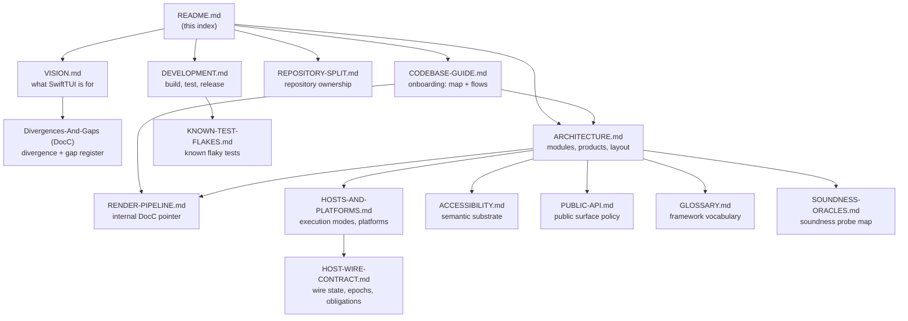

# SwiftTUI Documentation

SwiftTUI is a SwiftUI-shaped UI framework for the terminal, written in Swift.
You author `View` values in the same way as SwiftUI. SwiftTUI resolves,
lays out, and renders them as terminal text, a browser canvas, or a raster
surface embedded in a host app.

This folder holds **internal architecture and project documentation** for
maintainers. Developer-facing guides and API reference live in the in-source
DocC catalogs (see [API reference](#api-reference) below).

## Map

```mermaid
flowchart TD
    README["README.md<br/>(this index)"]
    GUIDE["CODEBASE-GUIDE.md<br/>onboarding: map + flows"]
    VISION["VISION.md<br/>what SwiftTUI is for"]
    GAP["Divergences-And-Gaps (DocC)<br/>divergence + gap register"]
    ARCH["ARCHITECTURE.md<br/>modules, products, layout"]
    SPLIT["REPOSITORY-SPLIT.md<br/>repository ownership"]
    PIPE["RENDER-PIPELINE.md<br/>internal DocC pointer"]
    HOSTS["HOSTS-AND-PLATFORMS.md<br/>execution modes, platforms"]
    WIRE["HOST-WIRE-CONTRACT.md<br/>wire state, epochs, obligations"]
    A11Y["ACCESSIBILITY.md<br/>semantic substrate"]
    API["PUBLIC-API.md<br/>public surface policy"]
    GLOSS["GLOSSARY.md<br/>framework vocabulary"]
    ORACLES["SOUNDNESS-ORACLES.md<br/>soundness probe map"]
    DEV["DEVELOPMENT.md<br/>build, test, release"]
    FLAKES["KNOWN-TEST-FLAKES.md<br/>known flaky tests"]

    README --> GUIDE
    README --> VISION
    README --> ARCH
    GUIDE --> ARCH
    GUIDE --> PIPE
    README --> SPLIT
    README --> DEV
    VISION --> GAP
    ARCH --> PIPE
    ARCH --> HOSTS
    HOSTS --> WIRE
    ARCH --> A11Y
    ARCH --> API
    ARCH --> GLOSS
    ARCH --> ORACLES
    DEV --> FLAKES
```

## Contents

| Document | What it covers |
| --- | --- |
| [CODEBASE-GUIDE.md](CODEBASE-GUIDE.md) | **Start here for new engineers.** A horizontal map (the module graph and a "where does X live?" subsystem table) plus vertical end-to-end traces (the interaction→update loop, app bootstrap & run-loop lifecycle, and host handoff). Complements the per-frame render-pipeline article rather than duplicating it. |
| [VISION.md](VISION.md) | What SwiftTUI is for, its design principles, and what is deliberately in and out of scope. |
| [Divergences and gaps](../Sources/SwiftTUIViews/SwiftTUIViews.docc/Divergences-And-Gaps.md) | The single divergence-and-gap register (a DocC article): where the public API departs from SwiftUI and where the code at `HEAD` falls short of the API shape or the project's stated intent. |
| [ARCHITECTURE.md](ARCHITECTURE.md) | Modules, products, the dependency graph, source layout, layout model, and a glossary. The starting point for understanding the codebase. |
| [REPOSITORY-SPLIT.md](REPOSITORY-SPLIT.md) | Repository ownership, release boundaries, and public documentation invariants. |
| [RENDER-PIPELINE.md](RENDER-PIPELINE.md) | Internal compatibility pointer to the DocC render pipeline guides. |
| [HOSTS-AND-PLATFORMS.md](HOSTS-AND-PLATFORMS.md) | Maintainer notes on host-code partitioning. The canonical host matrix, engine profiles, and platform support are the `Hosts-And-Platforms` DocC article. |
| [HOST-WIRE-CONTRACT.md](HOST-WIRE-CONTRACT.md) | The normative converged host-wire record, state, capability, delivery, and consumer contract at `HEAD`, including known gaps. |
| [ACCESSIBILITY.md](ACCESSIBILITY.md) | Maintainer notes on the semantic substrate: how one snapshot feeds all five host-side consumer paths. The authoring surface is documented in the `SwiftTUIViews` DocC catalog. |
| [PUBLIC-API.md](PUBLIC-API.md) | The public surface policy and inventory: what is canonical, what is package-only, and what was removed. |
| [GLOSSARY.md](GLOSSARY.md) | Framework vocabulary for architecture reviews: reconciliation/reuse, lifetimes, the cross-host wire, and the authoring seam. |
| [SOUNDNESS-ORACLES.md](SOUNDNESS-ORACLES.md) | The canonical map of reconciliation soundness probes: enforcement tier, sampling, release behavior, residual quarantine, and owning tests. |
| [DEVELOPMENT.md](DEVELOPMENT.md) | Toolchains, the build/test gate, fixture policy, and the release process. |
| [KNOWN-TEST-FLAKES.md](KNOWN-TEST-FLAKES.md) | The register of known, pre-existing flaky tests and how to tell a flake from a real regression. |

## API reference

The published reference is <https://swifttui.sh/docs/documentation/>.
Per-symbol API documentation is authored as DocC catalogs alongside the source:

- `Sources/SwiftTUICore/SwiftTUICore.docc` — geometry, phase products, cell/pixel metrics.
- `Sources/SwiftTUIViews/SwiftTUIViews.docc` — authoring views, state, focus, gestures, drawing.
- `Sources/SwiftTUIRuntime/SwiftTUIRuntime.docc` — the runtime, runtime render pipeline, hosting, running apps.
- `Sources/SwiftTUIAnimatedImage/SwiftTUIAnimatedImage.docc` — animated image playback.
- `Sources/SwiftTUIProfiling/SwiftTUIProfiling.docc` — optional profiling: `.profiling()`, the `SWIFTTUI_PROFILE` grammar, and the frame/memory/CPU signals.
- `Sources/SwiftTUI/SwiftTUI.docc` — the batteries-included convenience product.

Build the combined archive with `Scripts/build_docc_archive.sh`.

## Tooling files in this folder

`docs/` also holds four machine-managed files that are **not documentation** and
are not part of this hierarchy:

- `public_api_overrides.yml` — public-symbol classifications consumed by the API tooling.
- `PUBLIC_API_BASELINE.md` and `.public-api-baseline.txt` — generated public-symbol baselines.
- `.spi-api-baseline.txt` — the generated `@_spi` surface baseline.

`Scripts/generate_public_api_inventory.sh` produces and compares them. See
[DEVELOPMENT.md](DEVELOPMENT.md#public-api-baseline).
