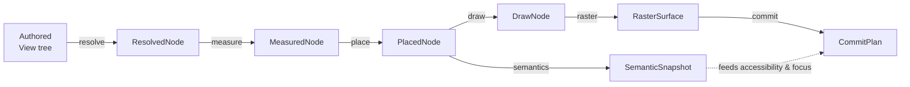
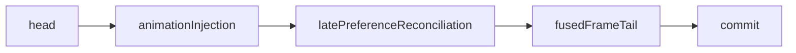
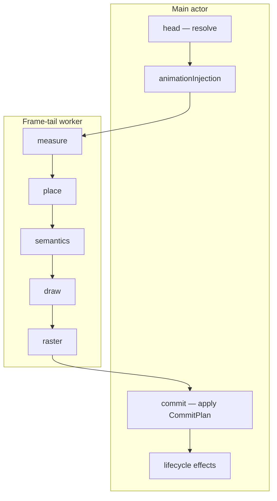
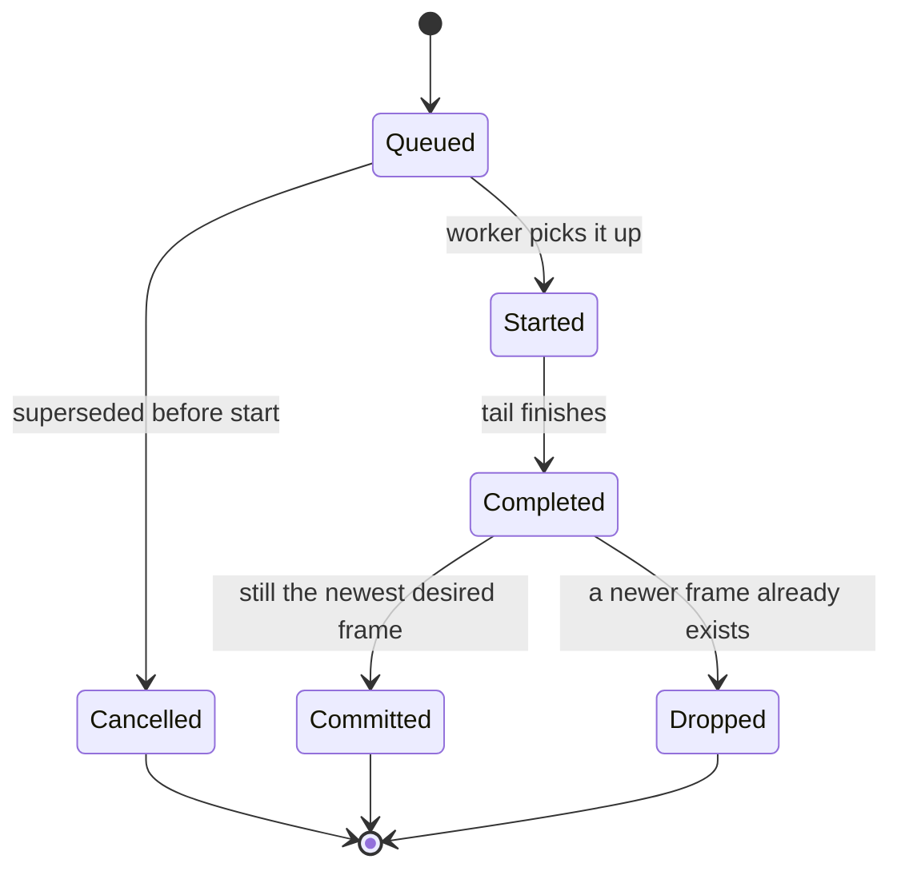

# Render Pipeline

This document describes how SwiftTUI turns an authored view tree into a
presented frame. It covers the seven phase products, the runtime stage
pipeline that drives them, the split between the main actor and the frame-tail
worker, and the policy for dropping stale frames.

Two things are easy to conflate, so they are kept distinct here:

- **Phase products** — *what* is computed. Seven typed value types defined in
  `SwiftTUICore`, each the input to the next phase.
- **Runtime stages** — *when and where* the work runs. A small pipeline in
  `SwiftTUIRuntime` (`RuntimeRenderPipeline`) that orders the phases and assigns
  each to the main actor or the frame-tail worker.

## The seven phase products

| Phase | Product | Responsibility |
| --- | --- | --- |
| resolve | `ResolvedNode` | Evaluate `body`, build the identity-bearing node graph, attach state. |
| measure | `MeasuredNode` | Run the recursive size negotiation via `LayoutEngine`. |
| place | `PlacedNode` | Assign each node a frame within its parent's bounds. |
| semantics | `SemanticSnapshot` | Extract the semantic/accessibility tree and focus information. |
| draw | `DrawNode` | Lower placed nodes to draw commands via `DrawExtractor`. |
| raster | `RasterSurface` | Paint draw commands into a cell surface via `Rasterizer`. |
| commit | `CommitPlan` | Diff against the previous frame and produce the host-applicable plan. |

All seven products are gathered on `FrameArtifacts`. They are distinct types on
purpose: each phase boundary is a typed contract, so a phase cannot silently
consume a half-built product from two phases back.

Semantics is computed from the placed tree alongside draw, and the
`SemanticSnapshot` it produces — including the flat `accessibilityNodes`
array — flows through to commit so every host can present it. See
[ACCESSIBILITY.md](ACCESSIBILITY.md).

## Host-Facing Raster Damage

The renderer has two damage boundaries:

- **Raster reuse hints** are private frame-tail inputs. They may let the
  rasterizer reuse rows from the previous renderer-committed `RasterSurface`
  while repainting a subset of rows. They are not frontend damage.
- **Host-facing raster damage** is the public presentation contract. It is
  derived from the previous `RasterSurface` actually presented to that frontend
  and the current committed `RasterSurface` after rasterization.

Renderer artifacts may also carry `FrameArtifacts.presentationDamage`. That
value is relative to renderer-committed raster history, so `RunLoop` re-derives
host-facing damage before presentation. Skipped or cancelled async artifacts
therefore cannot leak stale retained renderer history to terminal, web, or
host-managed frontends.

Presentation surfaces, WebHost/web-surface canvas rendering, and hosted raster
surfaces consume only host-facing raster damage. JSON frame output is rendered
by `JSONFrameRenderer` and does not carry `PresentationDamage`. A non-`nil`
damage value must cover every changed cell between the two committed raster
surfaces. `nil` means the previous surface is unavailable or incompatible and
consumers must repaint the full surface.

Detached overlays, presentation portals, and isolated compositing groups mark
shared `SurfaceCompositionMetadata`. When their topology changes, retained
raster reuse is suppressed and host-facing damage is still derived from the
actual raster diff.

## Raster Compositing

`View.blendMode(_:)` and `View.compositingGroup()` lower into an ordered draw
effect list that survives resolve, place, draw extraction, and rasterization.
The order is significant: `.blendMode(.multiply).compositingGroup()` applies the
blend while building the isolated group layer, while
`.compositingGroup().blendMode(.multiply)` first flattens the subtree and then
multiplies the resulting layer against its parent backdrop.

Without a compositing group, blend modes remain streaming cell effects. The
rasterizer inherits the current blend mode through the draw tree until a
descendant supplies another one, resolves source and backdrop
foreground/background colors at each cell write, and composites each channel
independently with `Color.composited` in linear sRGB.

`compositingGroup()` paints the node's commands, descendants, and post-child
commands into a temporary terminal-cell layer clipped to the visible subtree.
The flattened lead cells are then written back through the normal cell writer,
so wide-glyph continuation cells, hyperlinks, clipping, dirty-row culling, and
layout-border ordering stay on the same terminal-cell path. Terminal image
attachments are carried out unblended because they are presentation attachments,
not raster cells; terminal hosts still receive the attachment, but SwiftTUI
does not pretend to blend image pixels into the cell layer.

## The runtime stage pipeline

`RuntimeRenderPipeline` runs `RuntimeRenderStageName.orderedComposition` with an
exhaustive switch per stage. `DefaultRenderer` is composed through it.

- **head** — resolve the authored tree on the main actor. Side effects are
  staged in a transaction (see below).
- **animationInjection** — apply animation state to the resolved tree.
- **latePreferenceReconciliation** — settle preferences that depend on
  resolved geometry (bounded; see below).
- **fusedFrameTail** — measure, place, extract semantics, extract draw, and
  rasterize. This is the heavy work and is eligible to run off the main actor.
- **commit** — diff and apply the `CommitPlan` on the main actor.

## Main actor versus frame-tail worker

`DefaultRenderer` has a synchronous path and an async path (`renderAsync`). On
the async path, the heavy stages run on a **frame-tail worker** so the main
actor stays responsive to input.

- The worker is `FrameTailLayoutWorker`, backed by a serial `DispatchQueue`
  (`swift-tui.frame-tail-layout`) on Darwin and Linux. On WASI, where there is
  no background execution, an immediate inline worker runs the same stages
  synchronously. Timer wakeup accuracy for async Swift tasks is still owned by
  the browser worker's WASI scheduler; the render pipeline consumes the wakeups
  after the WASI runtime resumes Swift tasks.
- Built-in layout, custom layouts that conform to `SendableLayout`, framework
  `SendableLayout` containers, and snapshotted lazy child sources all run on
  the worker. A plain `Layout` conformer that is not `Sendable` falls back to
  the main actor — an intentional, safe default.
- Resolve and animation injection stay on the main actor because they evaluate
  authored `@MainActor` `body` closures. Commit and lifecycle effects stay on
  the main actor because they touch host surfaces and run user callbacks.

### One unified frame driver

The synchronous and async paths do not duplicate the post-acquisition logic.
Both `renderPendingFrames` and `renderPendingFramesAsync` delegate to a single
shared `@MainActor` body, `applyAcquiredFrame`, which interprets a
`FrameAcquisitionOutcome` and applies, drops, or defers the frame. There is one
implementation of "what to do with a finished frame," used by both paths.

## The frame-head transaction

Resolve has side effects: it registers runtime state, schedules animations, and
mutates subsystem bookkeeping. If a frame head is prepared and then discarded
(for example, a newer frame supersedes it), those side effects must not leak.

`FrameHeadTransaction` wraps the head stage. `AnimationController` exposes
`beginFrameHeadTransaction`, `commitFrameHeadTransaction`, and
`abortFrameHeadTransaction`. Prepared heads use draft runtime registrations
plus graph and state checkpoints. If the head is committed, the staged effects
become live; if it is aborted, every affected subsystem returns to its
previously committed baseline. The transaction stages effects rather than
mutating live state and rolling back.

## Late-preference reconciliation

Some preferences cannot be known until geometry resolves. The
`latePreferenceReconciliation` stage settles them, but it is **bounded**: the
reconciliation budget is `max(1, resolvedSubtreeNodeCount + 1)`. Exceeding it
emits the diagnostic warning `latePreference.reconciliationLimitExceeded`
rather than looping. The stage is a named, loop-bearing stage so the bound is
explicit and observable.

## Frame-drop policy

Under load, the renderer may have a newer desired frame before an older one
finishes. SwiftTUI drops stale frames deliberately rather than presenting
them late.

- Each frame carries a **render generation** id threaded through
  `DefaultRenderer.renderAsync` and `FrameTailRenderer`.
- There is a **single cancellation point**: a queued tail job can be cancelled
  before it starts. Once started, a tail job runs to completion and stays on
  the ordered-commit path.
- `FrameDropEligibility` classifies whether a frame may be dropped, with
  explicit blocker signals.
- `CompletedFramePolicy` compares a completed frame's generation against the
  newest desired generation. A stale, visually-empty completed frame is
  reconciled through `SkippedFrameReconciliation` as `.emptyVisualOnly`; a
  completed frame that applied side effects is reconciled as
  `.appliedSideEffects`; a frame that cannot be dropped is `.blocked`.
- Drop decisions are recorded in the diagnostics TSV (drop decision, dropped
  generation, reconciliation mode, presentation recovery), so frame loss is
  measurable rather than silent.

## Presentation

A committed frame reaches a host through `RunLoop.presentCommittedFrame`, which
builds a `SemanticHostFrame`. Terminal output specifically is written by a
`PresentationWriter` running on its own serial `DispatchQueue`, so blocking
`write(2)` calls never stall the run loop. How each host consumes the committed
frame is covered in [HOSTS-AND-PLATFORMS.md](HOSTS-AND-PLATFORMS.md).

## Diagnostics

Each committed frame produces a `RuntimeFrameSample` — raw phase timings, worker
enqueue and compute time, main-actor blocked and suspended time, input events
seen during render suspension, and the cancellation/drop policy state. The
runtime emits it to a `FrameDiagnosticSink` only when one is installed; with no
sink the per-frame path is a single branch.

The optional **`SwiftTUIProfiling`** product is the consumer-facing way to
capture this: add `.profiling()` to a scene and set `SWIFTTUI_PROFILE` (for
example `frames;tsv=/tmp/run.tsv`) to derive the rich per-frame record and write
TSV/JSONL/summary output, alongside the memory-occupancy and CPU/RSS signals.
See [the SwiftTUIProfiling DocC catalog](../Sources/SwiftTUIProfiling/SwiftTUIProfiling.docc/SwiftTUIProfiling.md).
The runtime carries no diagnostics logger of its own: the CLI and WASI runners
install small `FrameDiagnosticSink`s on the same contract (a TSV file for
`TERMUI_DIAGNOSTICS`; a browser stream for the web surface), and `Tools/TermUIPerf`
uses the product's `TSVFileSink`. The harness consumes the derived records to
compare runs; it does not yet enforce pass/fail budgets.
