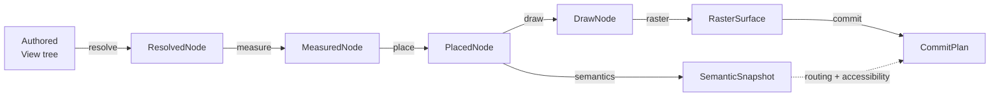

# Render Pipeline

This document is the code walkthrough for how SwiftTUI turns an authored
`App` or `View` into bytes, canvas updates, or a host-managed raster frame. It
is intentionally longer than the DocC rendering article: keep the short API
overview in DocC, and keep implementation-level runtime characteristics here.

The single most useful mental model is that SwiftTUI has two overlapping
pipelines:

- **Phase products** are the values the engine computes:
  `resolve -> measure -> place -> semantics -> draw -> raster -> commit`.
- **Runtime stages** are how an interactive session drives those products:
  `head -> animationInjection -> latePreferenceReconciliation ->
  fusedFrameTail -> commit`.

`SwiftTUICore` owns the phase products. `SwiftTUIRuntime` owns the stage
pipeline, the run loop, invalidation, frame dropping, lifecycle effects, and
the host-frame handoff. Terminal, WebHost, WASI, and hosted SwiftUI clients all
sit below the same committed-frame contract.

## The Whole Callpath

For an interactive app, the high-level path is:

```text
App.body / Scene.body
  -> collectWindowSceneSelections(...)
  -> SceneSession.run(...)
  -> RunLoop.run()
  -> RunLoop.renderPendingFramesAsync(...)
  -> DefaultRenderer.renderAsyncCancellableEliding(...)
  -> RuntimeRenderPipeline.renderCancellable(...)
  -> DefaultRenderer.computeFrameHead(...)
  -> DefaultRendererFrameTailCoordinator.renderFrameTailLayoutStage(...)
  -> DefaultRendererFrameTailCoordinator.renderFrameTailRasterStage(...)
  -> DefaultRenderer.resolveCompletedFrameCandidate(...)
  -> RunLoop.applyAcquiredFrame(...)
  -> RunLoop.presentCommittedFrame(...)
  -> TerminalHost / WebSurfaceTransport / HostedRasterSurface / WebSocketSurfaceTransport
```

The same `DefaultRenderer` can also be used directly for snapshots and
previews:

```text
DefaultRenderer.render(root, proposal:)
  -> RuntimeRenderPipeline.renderOneShot(...)
  -> FrameArtifacts
```

That one-shot path computes the same phase products, but it does not need the
interactive run loop, input pump, frame-tail cancellation, or host presentation.

## Where To Start In Code

| Question | Start here |
| --- | --- |
| How does an `App` become a run loop? | `Sources/SwiftTUIRuntime/Scenes/WindowSceneSelection.swift`, `Sources/SwiftTUIRuntime/Scenes/SceneSession.swift`, platform runners under `Platforms/` |
| How does the run loop decide a frame is needed? | `Sources/SwiftTUIRuntime/RunLoop/RunLoop.swift`, `Sources/SwiftTUIRuntime/RunLoop/RunLoop+Rendering.swift`, `Sources/SwiftTUIRuntime/RunLoop/RunLoop+FrameAcquisition.swift` |
| What is the renderer entry point? | `Sources/SwiftTUIRuntime/SwiftTUI.swift` (`DefaultRenderer`) |
| What is the stage executor? | `Sources/SwiftTUIRuntime/Rendering/RuntimeRenderPipeline.swift` |
| Where does resolve happen? | `Sources/SwiftTUIRuntime/Rendering/DefaultRendererFrameHeadCoordinator.swift`, `Sources/SwiftTUIViews/Foundation/ViewFoundation.swift`, `Sources/SwiftTUICore/Resolve/ViewGraph.swift` |
| Where do measure/place/semantics/draw/raster run? | `Sources/SwiftTUIRuntime/Rendering/FrameTailRenderer.swift`, `Sources/SwiftTUIRuntime/Rendering/FrameTailRenderer+InlineStages.swift` |
| Where does commit decide side effects and frame drops? | `Sources/SwiftTUIRuntime/Rendering/DefaultRenderer+CompletedFrameCandidates.swift` |
| Where does a committed frame reach hosts? | `Sources/SwiftTUIRuntime/RunLoop/RunLoop+Presentation.swift`, `Sources/SwiftTUIRuntime/Terminal/PresentationSurface.swift` |
| Where are profiling records emitted? | `Sources/SwiftTUIRuntime/RunLoop/RunLoop+FrameDiagnostics.swift`, `Sources/SwiftTUIRuntime/Diagnostics/RuntimeFrameSample.swift`, `Sources/SwiftTUIProfiling/` |

Paths above are relative to the `swift-tui` package root.

## Client Entry Points

SwiftTUI has several clients, but they all converge on `SceneSession.run` and
then `RunLoop`.

### Terminal CLI

`TerminalRunner` lives in `Platforms/CLI/Sources/SwiftTUICLI/TerminalRunner.swift`.
It collects `WindowGroup` selections from `app.body`, creates a `TerminalHost`,
input reader, signal reader, scheduler, `StateContainer`, and `FocusTracker`,
then runs the selected scene.

The normal `SwiftTUI` convenience product reaches this path through
`SwiftTUIWebHostCLI`: `WebHostCLIRunner` parses standard options and routes to
`TerminalRunner` unless the configuration asks for `--web`.

### Localhost WebHost

`WebHostRunner` lives in `Platforms/WebHost/Sources/SwiftTUIWebHost/`.
It starts the embedded HTTP/WebSocket server, opens the browser when configured,
creates a `WebSocketSurfaceTransport`, and runs the selected scene with that
transport as the presentation surface.

The runtime does not know it is serving a browser. It sees a
`SemanticHostFramePresentationSurface` that accepts committed frames and
serializes them to the web-surface protocol.

### WASI Browser

`WASIRunner` lives in `Platforms/WASI/Sources/SwiftTUIWASI/WASIRunner.swift`.
In normal browser mode it creates a `WebSurfaceTransport`, a web-surface input
reader, and an in-process signal reader for resize/style changes. The Swift
pipeline is the same, but the frame-tail worker is inline on WASI because
there is no background `DispatchQueue`.

The browser worker owns WASI stdin/timer readiness. SwiftTUI consumes the
wakeups after Swift tasks resume; it does not poll JavaScript directly from the
render pipeline.

### Host-Managed SwiftUI

`HostedSceneSession` and `HostedRasterSurface` live under
`Sources/SwiftTUIRuntime/Scenes/`; the macOS view bridge lives in
`Platforms/SwiftUI/Sources/SwiftUIHost/`. A native app creates a
`HostedRasterSurface`, starts a `HostedSceneSession`, and receives
`SemanticHostFrame` callbacks.

That host owns native layout and drawing. SwiftTUI owns the raster/semantic
frame and damage contract.

## Scene Session And Run Loop Setup

`SceneSession.run` is the convergence point for runners. It builds:

- `EnvironmentValues` from the presentation surface's appearance and theme.
- `EnvironmentSnapshot` values such as `surface`, `session`, `scene`, and
  `windowTitle`.
- `RunLoop<SceneSessionState, WindowHostView<...>>`, where `WindowHostView`
  wraps the scene's root view.
- Optional `FrameDiagnosticSink`, progress probe, runtime issue sink, and
  explicit render mode.

`RunLoop.run` owns the interactive session. It attaches invalidators to
`StateContainer`, `FocusTracker`, and the observation bridge; enables raw
terminal mode when the output mode is `.tui`; starts the event pump; requests
the first root invalidation; renders the initial frame; then enables selective
dirty evaluation for later frames.

After startup, the run loop alternates between:

1. Drain input, signal, animation-deadline, task, and observation wakeups.
2. Coalesce those wake causes into a `ScheduledFrame`.
3. Acquire one converged frame from the renderer.
4. Apply and present the committed frame.
5. Schedule the next animation deadline if needed.

Static apps are therefore event-driven: when nothing invalidates and no
animation deadline is pending, the render pipeline does no frame work.

## Frame Acquisition In The Run Loop

`RunLoop.renderPendingFramesAsync` is the production frame driver. It consumes
ready frames from the scheduler and runs a focus-synchronization convergence
loop around renderer acquisition.

Before each acquisition it may force a root evaluation or suppress retained
reuse:

- Root evaluation is required when focus-sync rerenders need to revisit the
  whole graph.
- Retained reuse is suppressed on frames where a focus move or in-flight
  property animation makes reuse unsafe. Forcing root evaluation only makes the
  graph walk reach each node; every reached node can still choose reuse unless
  `suppressRetainedReuseForNextFrame()` is also set.

`RunLoop.acquireFrameArtifactsAsync` chooses the renderer strategy:

- `.sync`: call `DefaultRenderer.renderEliding`.
- `.async` without an event pump: call `DefaultRenderer.renderAsyncEliding`.
- `.async` with an event pump: call
  `DefaultRenderer.renderAsyncCancellableEliding`.

The cancellable path is the important interactive path. It can cancel a queued
frame-tail job before that job starts when a newer render intent arrives. Once
a tail job starts, it runs to completion; the completed frame may still be
dropped later if it is stale and visual-only.

## DefaultRenderer

`DefaultRenderer` is the public renderer and the run loop's private workhorse.
It owns:

- Core components: `Resolver`, `LayoutEngine`, `SemanticExtractor`,
  `DrawExtractor`, `Rasterizer`, and `CommitPlanner`.
- Runtime state: `ViewGraph`, frame resolve state, presentation portal state,
  animation controller, render-generation sequencer, elided-frame counter, and
  frame-tail retained state.
- The `FrameTailRenderer`, which runs measure/place/semantics/draw/raster and
  stores retained frame data for future reuse.

The three renderer modes share the same stages:

- `render(...)`: one-shot, synchronous, returns `FrameArtifacts`.
- `renderAsync(...)`: async frame-tail, but non-cancellable.
- `renderAsyncCancellable(...)`: async frame-tail with queued-tail
  cancellation and completed-frame drop policy.

The run loop calls the `...Eliding` variants so off-screen animation ticks can
commit animation state without running the frame tail or presenting a frame.

## Stage Pipeline

`RuntimeRenderPipeline` has no stored configuration. Every entry point walks
`RuntimeRenderStageName.orderedComposition`:

```text
head
animationInjection
latePreferenceReconciliation
fusedFrameTail
commit
```

The executor is intentionally small and exhaustive. Adding or reordering a
stage changes the enum and the switch statements.

### `head`

The caller computes the head before the executor loop. `DefaultRenderer` does
that through `DefaultRendererFrameHeadCoordinator.computeFrameHead`.

The head stage:

- Allocates a new render generation.
- Builds a `FrameHeadTransaction` and, for abortable frames, checkpoints the
  graph/frame/registration/portal/observation/animation state that must roll
  back if the frame is cancelled or dropped.
- Prepares `FrameResolveInputs` from the current `ResolveContext`, proposal,
  environment, invalidation set, transaction, and reuse-suppression flag.
- Begins graph evaluation and installs the presentation portal evaluator around
  the authored root.
- Evaluates the dirty graph frontier or falls back to root evaluation.
- Snapshots retained frame-tail inputs from the previous committed frame.

The output is a `FrameHeadDraft`: resolved tree, frame-tail input, transaction,
generation, timing clock, runtime issues, and the frame context needed at
commit.

### `animationInjection`

`DefaultRendererFrameHeadCoordinator.injectAnimations` applies sampled
animation values to the resolved tree and updates the `FrameTailInput`.

For abortable frames, it may materialize prepared graph state to snapshot lazy
indexed child sources into worker-safe values, then suspend that prepared state
again before the off-main tail starts.

Immediately after this stage, the off-screen elision gate can fire. If the
current animation tick only affects identities that were not visibly drawn in
the previous committed frame, the renderer runs a reduced commit:

- animation completions and live animation state advance on schedule;
- no measure/place/semantics/draw/raster work runs;
- no host frame is presented;
- diagnostics record the frame as `elided`.

This is a scheduling optimization, not a replacement for completed-frame drop
policy.

### `latePreferenceReconciliation`

Some preferences depend on resolved geometry, so they cannot be settled during
plain body evaluation. `LatePreferenceReconciliationStage` loops layout enough
to reconcile those preferences, but the loop is bounded:

```text
max(1, resolvedSubtreeNodeCount + 1)
```

Exceeding the budget emits a diagnostic instead of spinning indefinitely.

On the async path, this stage may run the layout work on the frame-tail worker
when the resolved tree is safe to offload. If layout-dependent content needs
prepared graph state, the coordinator materializes that state on the main actor
around the async layout call and suspends it afterward.

### `fusedFrameTail`

The tail is "fused" as a runtime stage because the scheduler treats it as the
heavy middle of a frame, but the phase products remain separate.

`FrameTailInlineStageRenderer.renderInlineLayoutStage` runs:

```text
LayoutEngine.measure(...)
LayoutEngine.place(...)
```

`DefaultRendererFrameTailCoordinator.prepareAnimationOverlaySnapshot` captures
the baseline placed tree for animation removal snapshots and retained-layout
history, then samples placed animation overlays.

`FrameTailInlineStageRenderer.renderInlineRasterTail` then runs:

```text
apply placed animation overlay
FrameTailPresentationDamageResolver.resolve(...)
SemanticExtractor.extract(from: placed)
DrawExtractor.extract(from: placed)
Rasterizer.rasterizeCollectingVisibleIdentities(...)
RasterSurfaceDamageDiff.diff(previous:current:)
```

The current `placed` tree after overlay application is the effective input for
semantics, draw, raster, and commit. The retained-layout baseline remains the
canonical placement result before animation overlays.

### `commit`

The commit stage is still on the main actor because it mutates runtime state
and installs user callbacks.

The async path first builds a `CompletedFrameCandidate`:

1. Preview the `CommitPlan` against the prepared frame head.
2. Build preview `FrameArtifacts`.
3. Classify `FrameDropEligibility`.
4. Compare the candidate render generation with the newest desired generation.

If the completed frame is stale and visual-only, it can be dropped and the
prepared frame head is aborted. If it must commit, the renderer materializes the
prepared state and runs `commitFrameEffects`:

- `ViewGraph.finalizeFrame(...)` computes lifecycle events and updates live
  graph state.
- `FrameHeadTransaction.commit()` publishes staged runtime registrations,
  observation, portal, and animation state.
- `CommitPlanner.plan(...)` packages semantic/lifecycle/handler work into a
  `CommitPlan`.
- Worker custom layout cache updates are applied.
- The measurement cache is pruned to live identities.

Finally, `CommittedFrameArtifactBuilder` gathers the seven phase products,
presentation damage, drawn identities, diagnostics, timing, and the commit plan
into `FrameArtifacts`, and `publishCommittedFrame` stores retained tail state
for the next frame.

## The Seven Phase Products



| Phase | Product | Responsibility | Primary cost shape |
| --- | --- | --- | --- |
| resolve | `ResolvedNode` | Evaluate authored bodies, attach identity, state, environment, metadata, and runtime registrations. | Main actor. Ideally proportional to dirty frontier plus reuse bookkeeping after the first frame. |
| measure | `MeasuredNode` | Run recursive size negotiation through `LayoutEngine`. | Tree/layout dependent. Can run off-main when the tree and custom layouts are safe. |
| place | `PlacedNode` | Assign integer-cell frames, content bounds, and placement-time metadata. | Tree/layout dependent. Retained placement can reuse geometry and skip identical metadata sync. |
| semantics | `SemanticSnapshot` | Extract focus, interaction, scroll, selection, named coordinate spaces, accessibility nodes, and warnings. | Walks the effective placed tree. |
| draw | `DrawNode` | Lower placed nodes into draw commands, borders, backgrounds, effects, and payload paint instructions. | Walks the placed tree and allocates the draw command tree. |
| raster | `RasterSurface` | Paint draw commands into styled terminal cells and image attachments. | Proportional to surface/dirty rows plus visible draw work. |
| commit | `CommitPlan` | Package lifecycle events, handler installations, semantic snapshot, and transaction effects. | Main actor. Should scale with changed publication scope, not full live tree on narrow updates. |

All seven products live together in `FrameArtifacts`. That bundle is useful for
inspection and retained reuse, but each field has separate ownership:

- `resolvedTree`, `measuredTree`, `semanticSnapshot`, `drawTree`, and
  `rasterSurface` are canonical phase products.
- `placedTree` is the current effective placed tree; retained layout stores the
  pre-overlay baseline separately.
- `presentationDamage` is renderer-artifact damage, not automatically
  host-facing damage.
- `drawnIdentities` is a visibility signal, not a dirty-cell list.
- `commitPlan` is the side-effect plan.
- `diagnostics` carries timings, counts, damage diagnostics, runtime issues,
  and worker/main-actor timing.

## Resolve Characteristics

Resolve is where authored SwiftUI-shaped code is evaluated. `Resolver.resolve`
calls `resolveView`; views that conform to `ResolvableView` lower directly,
while ordinary views evaluate `body`.

Interactive resolve runs inside `ViewGraph`:

- `ViewGraph.beginFrame()` clears per-frame order and event state.
- Dirty identities are queued from state, focus, environment, observation, input,
  animation, and explicit invalidations.
- `ViewGraphDirtyEvaluationPlanner` picks dirty frontiers when selective
  evaluation is enabled.
- `ViewGraph.evaluateDirtyNodes(...)` evaluates only those frontiers, or the
  root when a frontier is unavailable or root evaluation is forced.
- `ViewNode` stores the committed `ResolvedNode`, state slots, dependencies,
  lifecycle state, evaluator closure, and runtime handler registrations.

After the initial frame, `RunLoop` enables selective evaluation. Narrow
invalidation should then avoid re-evaluating unrelated subtrees. Retained
subtree reuse is the second fast path: if a subtree is disjoint from the
invalidation, has a fresh committed snapshot, has the same environment, and has
reuse-equivalent transaction intent, `ViewGraph.reusableSnapshot` returns the
committed subtree instead of evaluating its body.

Important reuse details:

- `TransactionSnapshot.isReuseEquivalent` intentionally ignores the per-frame
  debug signature, so frame-cause text does not defeat reuse.
- Focus identity is deliberately excluded from environment equality, so focus
  moves suppress retained reuse for the whole frame.
- In-flight property animations also suppress retained reuse so animation
  registrations keep being refreshed.
- A fully retained subtree records only its root for per-frame bookkeeping; its
  descendants' committed presence and liveness carry forward.

Performance implication: on inert narrow updates, recomputed node count should
scale with the changed subtree, not total tree size. Residual resolve cost can
still include frontier selection, retained-root checks, snapshot assembly, and
frame finalization bookkeeping.

## Layout And Placement Characteristics

`LayoutEngine.measure` and `LayoutEngine.place` are recursive SwiftUI-shaped
layout passes:

1. Parents propose sizes.
2. Children return desired sizes.
3. Parents place children in integer-cell bounds.

The async renderer tries to run layout on `FrameTailLayoutWorker`. On Darwin
and Linux the worker is a serial `DispatchQueue` named
`swift-tui.frame-tail-layout`; on WASI it is an immediate inline worker. Layout
falls back to the main actor when the tree includes layout-dependent content or
non-sendable custom layout work that cannot safely cross actors.

Placement uses retained layout when the resolved subtree is placement-equivalent
to the previous committed baseline. There are three relevant outcomes:

- divergent: recompute placement normally;
- geometry reusable: reuse geometry but refresh resolved-derived metadata;
- identical: reuse the cached placed subtree without rebuilding metadata.

The identical-subtree skip matters because metadata synchronization used to be
an O(subtree) walk on every retained placement. The current path folds metadata
equality into the equivalence walk that already had to run.

## Semantics, Draw, And Raster Characteristics

Semantics and draw both consume the effective placed tree.

`SemanticExtractor.extract` walks placed nodes to produce:

- interaction regions and hit-test order;
- focus regions and focus scopes;
- scroll routes, scroll targets, and selection routes;
- named coordinate spaces;
- accessibility nodes, announcements, and warnings.

`DrawExtractor.extract` lowers placed nodes into a draw tree. It reads geometry,
clipping, layout metadata, draw metadata, effects, environment style, and draw
payloads. Raster has no reason to know about authored view bodies.

`Rasterizer.rasterizeCollectingVisibleIdentities` paints the draw tree into a
`RasterSurface`. It can reuse a previous surface when the supplied damage is
sound for the current surface size and does not require full repaint/replay.
Incremental rasterization:

- starts from previous cells and image attachments;
- clears dirty rows/ranges;
- repaints only the dirty row range;
- verifies against a fresh raster when damage suppressed painting;
- refines damage to the actual current-vs-previous surface diff.

`visibleIdentities` records which draw nodes had non-empty visible bounds after
clipping. It answers "could this identity paint cells in this viewport?" rather
than "did this identity repaint dirty cells on this frame?"

## Damage Boundaries

There are two damage boundaries and they must not be confused.

**Raster reuse hints** are private frame-tail inputs. They let the rasterizer
reuse parts of the previous renderer-committed surface. They are not a frontend
contract.

**Host-facing raster damage** is the public presentation contract. It is
derived in `RunLoop.presentationDamage(for:)` from the previous `RasterSurface`
actually presented to that runtime/frontend pair and the current committed
surface. This re-derivation is required because async artifacts can be skipped,
cancelled, or dropped; a frontend must never receive damage relative to a frame
it did not see.

For hosts:

- `nil` damage means repaint the full surface.
- non-`nil` empty damage means no visible raster cells changed.
- non-`nil` row/range damage is relative to the previous surface presented to
  the same host.

Detached overlays, portals, and compositing topology can suppress retained
raster reuse; host-facing damage is still derived from the actual presented
raster history.

## Commit Characteristics

Commit is the bridge between pure frame products and live runtime state. It
does not write to the terminal directly. It creates a `CommitPlan`, publishes
staged graph/registration/animation state, and stores retained renderer state.

The expensive commit work historically came from republishing every live node's
runtime registrations every committed frame. The current implementation scopes
runtime-registration restore to the publication mode:

- `.all`: full restore, used for initial/full rebuild frames.
- `.subtrees(roots)`: remove and restore only changed subtrees, then normalize
  order-sensitive focus registries.
- `.unchanged`: skip restore because the live registry is already canonical.

This is why commit cost on narrow interactions should scale with the changed
subtree, not the whole live graph. If `commit_ms` scales with total tree size
on an inert interaction, check runtime-registration publication before looking
at `CommitPlanner.plan`; the planner itself is intentionally small.

## Main Actor, Worker, And Cancellation

The actor split is a performance contract:

- **Main actor:** resolve, animation injection, frame-head transactions,
  completed-frame commit/drop decisions, lifecycle effects, focus updates,
  presentation dispatch, and user callbacks.
- **Frame-tail worker:** eligible layout plus raster-tail work
  (measure/place/semantics/draw/raster) when inputs are sendable and no prepared
  graph materialization is required.

The cancellable async path has one cancellation point: a queued layout-stage
job can be cancelled before it starts. Once the worker starts computing a tail,
the job runs to completion. The completed result then goes through
`CompletedFramePolicy`:

- newest desired generation wins;
- visual-only stale frames may be dropped;
- frames with lifecycle, handler, animation-completion, transition, semantic,
  or other blocker effects must commit;
- dropped/cancelled frames emit zero-artifact diagnostics and do not increment
  the committed-frame count.

This keeps input responsive without silently losing side effects.

## Applying A Committed Frame

Once acquisition returns a converged `FrameArtifacts`,
`RunLoop.applyAcquiredFrame` performs the shared post-acquisition body for both
sync and async drivers:

1. Report runtime issues.
2. Merge deferred lifecycle carry-forward into the `CommitPlan`.
3. Append pending accessibility announcements.
4. Update `latestSemanticSnapshot`.
5. Derive focus presentation.
6. Present the frame with host-facing damage.
7. Record the presented raster surface.
8. Apply lifecycle/task effects.
9. Update focus presentation and focused-values state.
10. Reconcile preference observations.
11. Flush post-action invalidations.
12. Schedule the next animation deadline when the animation controller has
    pending work.
13. Prune observation dependencies.
14. Emit `RuntimeFrameSample` diagnostics when a sink is installed.

The run loop uses `latestSemanticSnapshot` between frames for focus traversal,
pointer hit testing, gesture routing, scroll routing, and coordinate-space
queries.

## Host Presentation

`RunLoop.presentCommittedFrame` chooses a presentation path from
`RuntimeConfiguration.output` and the surface roles implemented by the host.

### JSON and Accessible Output

`output == .json` renders a JSON frame through `JSONFrameRenderer` and writes it
to a `TerminalCommandPresentationSurface`. `output == .accessible` renders the
semantic snapshot through `LinearAccessibilityRenderer` plus live-region
announcements. These modes are command-output modes, not raster host modes.

### Semantic Host Frames

If the surface conforms to `SemanticHostFramePresentationSurface`, the run loop
builds a `SemanticHostFrame` with:

- monotonic `sequence`;
- `RasterSurface`;
- `SemanticSnapshot`;
- focused identity;
- host-facing `PresentationDamage`;
- preferred layout size, when derivable.

WASI, WebHost, and hosted SwiftUI use this path because they need semantics as
well as raster cells.

### TerminalHost

`TerminalHost` conforms to `DamageAwarePresentationSurface`. It plans a
terminal presentation from the previous submitted surface, the current prepared
surface, and host-facing damage. It can emit either a full repaint or
incremental row/span updates. Image attachments are prepared for terminal
graphics protocols before planning.

Terminal bytes are submitted to `TerminalPresentationWriter`, a private serial
writer. The writer keeps only the newest pending frame; if a queued frame is
replaced before being written, `TerminalHost` marks retained presentation state
dirty and the next frame recovers with a full repaint. This prevents blocking
`write(2)` from stalling the run loop while still keeping terminal state sound.

### WebSurfaceTransport and WebSocketSurfaceTransport

The WASI `WebSurfaceTransport` writes web-surface frames to stdout. The
localhost `WebSocketSurfaceTransport` writes the same protocol over a WebSocket
byte sink. Both accept `SemanticHostFrame` and call `WebSurfaceFrameEncoder`.

The encoder includes raster rows, styles, image attachments, optional damage,
accessibility tree, accessibility announcements, focused identity, and sequence
metadata. When delta encoding is enabled and the baseline is compatible, it can
emit a version-3 delta frame containing only damaged rows.

The WebHost transport uses `ByteSinkPump` so enqueueing frame bytes is
synchronous and nonblocking; async network sends drain on a dedicated task.

### HostedRasterSurface

`HostedRasterSurface` stores recent `SemanticHostFrame` values, resumes test
waiters, calls the host's frame handler on the main actor, and returns
`rasterHostMetrics`. `NativeTerminalSurfaceView` consumes the raster and damage
to invalidate only dirty native rects when possible.

## Diagnostics And Profiling

With no sink installed, the per-frame diagnostics path is just a branch. When a
sink is installed, every committed frame emits `RuntimeFrameSample.committed`;
cancelled/dropped tails emit `zeroArtifact`; off-screen elisions emit `elided`.

A committed sample includes:

- raw phase timings (`resolve`, `measure`, `place`, `semantics`, `draw`,
  `raster`, `commit`);
- worker enqueue/compute/completion timing;
- main-actor blocked and suspended timing;
- render and desired generation;
- wake causes and coalescing counts;
- focus-sync rerenders;
- animation-controller active/pending state;
- queued input seen during render suspension;
- drop eligibility and completed-frame decision;
- presentation metrics and presentation duration.

The optional `SwiftTUIProfiling` product is the consumer-facing way to collect
these records. Add `.profiling()` and set `SWIFTTUI_PROFILE`, for example:

```bash
SWIFTTUI_PROFILE="frames,cpu,memory@1s;tsv=/tmp/swifttui-frames.tsv"
```

`Tools/TermUIPerf` uses the same runtime diagnostics layer for repeatable
scenarios and comparisons.

## Performance Characteristics From Recent Work

The current performance work in `docs/reports/` is useful background for new
runtime contributors:

- The Gallery baseline showed static tabs are idle-quiet, while off-screen or
  perpetual animations can request many frames. It also showed terminal I/O was
  not the bottleneck in the measured workload; CPU was spent in the frame
  pipeline.
- H2 fixed retained resolve reuse so narrow inert interactions recompute the
  changed subtree instead of re-resolving the whole graph.
- H3 removed O(subtree) retained-reuse bookkeeping for fully retained subtrees.
- The commit breakdown showed `transaction.commit()` runtime-registration
  restore, not `CommitPlanner.plan`, was the main O(tree) `commit_ms` cost.
- The registration-restore fix scoped commit publication to changed subtrees
  and skipped `.unchanged` restores.
- The placement sync-skip work eliminated an unnecessary metadata rebuild for
  identical retained placement subtrees.

When investigating a new performance issue, start with the frame TSV:

1. Check whether frames are being produced at all while idle.
2. Compare `damage_*` to frame count: zero-damage committed frames are pipeline
   CPU, not terminal repaint work.
3. Identify the dominant phase.
4. Compare node counts (`resolved_computed`, `resolved_reused`) and tree size.
5. Separate renderer artifact damage from host-facing `present_*` metrics.
6. Check whether a frame is `.all`, `.subtrees`, `.unchanged`, cancelled,
   dropped, or elided before attributing cost.

## Invariants To Preserve

- Public child repos must be able to build through native tools; performance
  scenarios that depend on sibling examples belong in the coordination overlay,
  not the public `swift-tui` manifest.
- Resolve and commit stay on the main actor because they evaluate authored
  bodies, mutate runtime state, and run user-visible effects.
- Frame-head side effects must be staged in `FrameHeadTransaction`; aborting or
  dropping a prepared frame must not leak registrations, graph changes,
  animation state, or observation state.
- Host-facing damage is always derived against the previous actually presented
  raster surface for that host.
- A queued async tail can be cancelled before start; a started tail must either
  commit, drop through the completed-frame policy, or report zero-artifact
  diagnostics.
- Retained reuse must remain disabled on focus-move and in-flight animation
  frames until a narrower correctness proof replaces that broad gate.
- A host consumes `PresentationSurface` roles or `SemanticHostFrame`; it should
  not reach into renderer-private retained state.
